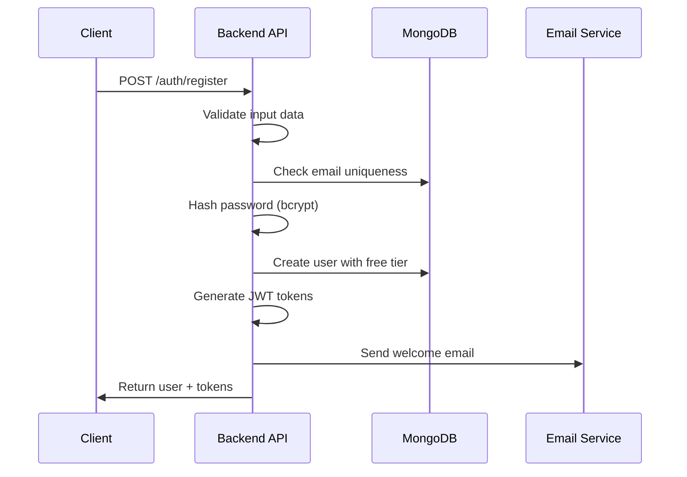
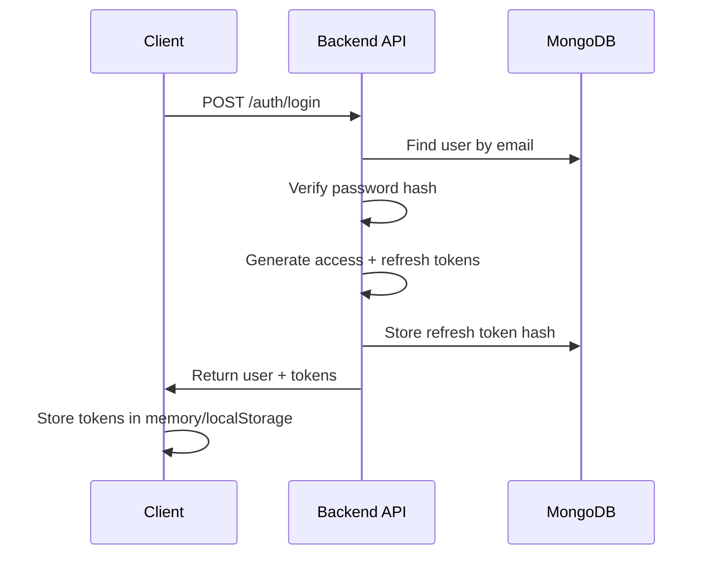
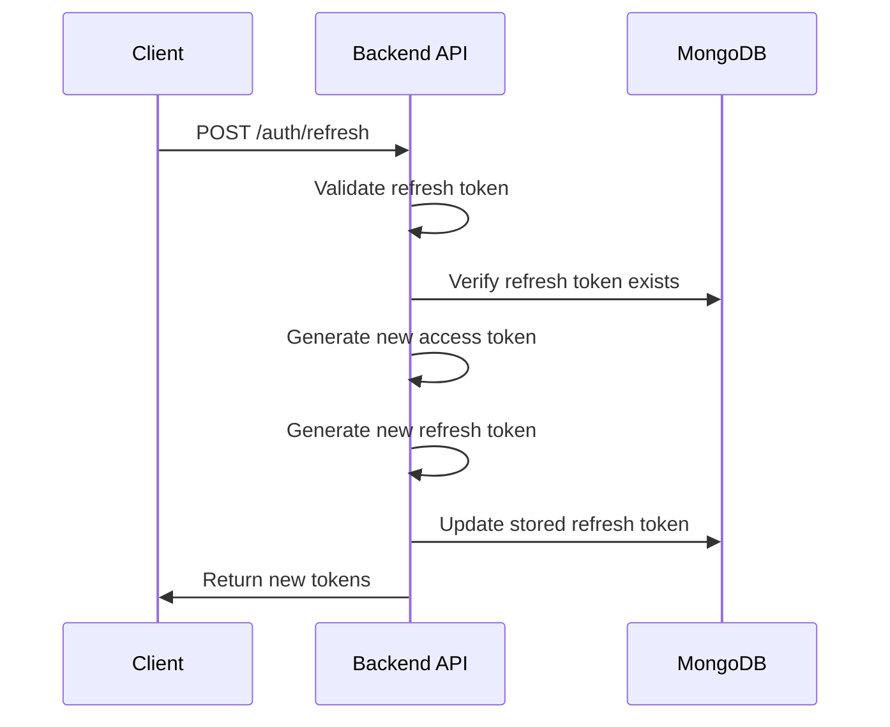

# Authentication & Authorization

## JWT-based Authentication System

The D&D Encounter Tracker implements a secure JWT-based authentication system with refresh tokens, role-based access control, and admin privilege escalation.

## Authentication Flow

### Registration Process


### Login Process


### Token Refresh Process


## JWT Implementation

### Token Structure
```typescript
// Access Token Payload (15-minute expiry)
interface AccessTokenPayload {
  userId: string;
  email: string;
  isAdmin: boolean;
  subscription: {
    tier: string;
    status: string;
  };
  features: FeatureFlags;
  iat: number;           // Issued at
  exp: number;           // Expires at
  iss: string;           // Issuer
  aud: string;           // Audience
}

// Refresh Token Payload (7-day expiry)
interface RefreshTokenPayload {
  userId: string;
  tokenId: string;       // Unique token identifier
  iat: number;
  exp: number;
  iss: string;
  aud: string;
}
```

### Token Generation Service
```typescript
class TokenService {
  private accessTokenSecret: string;
  private refreshTokenSecret: string;
  
  generateAccessToken(user: User): string {
    const payload: AccessTokenPayload = {
      userId: user._id.toString(),
      email: user.email,
      isAdmin: user.isAdmin || false,
      subscription: {
        tier: user.subscription.tier,
        status: user.subscription.status
      },
      features: user.features,
      iat: Math.floor(Date.now() / 1000),
      exp: Math.floor(Date.now() / 1000) + (15 * 60), // 15 minutes
      iss: 'dnd-tracker',
      aud: 'dnd-tracker-client'
    };
    
    return jwt.sign(payload, this.accessTokenSecret, {
      algorithm: 'HS256'
    });
  }
  
  generateRefreshToken(userId: string): string {
    const tokenId = crypto.randomUUID();
    const payload: RefreshTokenPayload = {
      userId,
      tokenId,
      iat: Math.floor(Date.now() / 1000),
      exp: Math.floor(Date.now() / 1000) + (7 * 24 * 60 * 60), // 7 days
      iss: 'dnd-tracker',
      aud: 'dnd-tracker-client'
    };
    
    return jwt.sign(payload, this.refreshTokenSecret, {
      algorithm: 'HS256'
    });
  }
  
  verifyAccessToken(token: string): AccessTokenPayload {
    return jwt.verify(token, this.accessTokenSecret) as AccessTokenPayload;
  }
  
  verifyRefreshToken(token: string): RefreshTokenPayload {
    return jwt.verify(token, this.refreshTokenSecret) as RefreshTokenPayload;
  }
}
```

## Middleware Implementation

### Authentication Middleware
```typescript
const authenticateToken = async (
  req: AuthenticatedRequest,
  res: Response,
  next: NextFunction
) => {
  try {
    const authHeader = req.headers.authorization;
    const token = authHeader && authHeader.split(' ')[1]; // Bearer TOKEN
    
    if (!token) {
      return res.status(401).json({
        success: false,
        error: {
          code: 'MISSING_TOKEN',
          message: 'Access token is required'
        }
      });
    }
    
    const decoded = tokenService.verifyAccessToken(token);
    
    // Fetch fresh user data to ensure current subscription status
    const user = await User.findById(decoded.userId);
    if (!user) {
      return res.status(401).json({
        success: false,
        error: {
          code: 'USER_NOT_FOUND',
          message: 'User not found'
        }
      });
    }
    
    // Check if subscription status has changed
    if (user.subscription.status !== decoded.subscription.status) {
      return res.status(401).json({
        success: false,
        error: {
          code: 'TOKEN_STALE',
          message: 'Token is stale, please refresh'
        }
      });
    }
    
    req.user = user;
    req.token = decoded;
    next();
  } catch (error) {
    if (error.name === 'JsonWebTokenError') {
      return res.status(401).json({
        success: false,
        error: {
          code: 'INVALID_TOKEN',
          message: 'Invalid access token'
        }
      });
    }
    
    if (error.name === 'TokenExpiredError') {
      return res.status(401).json({
        success: false,
        error: {
          code: 'TOKEN_EXPIRED',
          message: 'Access token expired'
        }
      });
    }
    
    next(error);
  }
};
```

### Admin Authorization Middleware
```typescript
const requireAdmin = (
  req: AuthenticatedRequest,
  res: Response,
  next: NextFunction
) => {
  if (!req.user?.isAdmin) {
    return res.status(403).json({
      success: false,
      error: {
        code: 'INSUFFICIENT_PRIVILEGES',
        message: 'Admin privileges required'
      }
    });
  }
  
  next();
};
```

### Subscription Feature Middleware
```typescript
const requireFeature = (featureName: string) => {
  return (req: AuthenticatedRequest, res: Response, next: NextFunction) => {
    // Admin override - admins have access to all features
    if (req.user?.isAdmin) {
      return next();
    }
    
    const hasFeature = req.user?.features[featureName];
    
    if (!hasFeature) {
      return res.status(403).json({
        success: false,
        error: {
          code: 'FEATURE_NOT_AVAILABLE',
          message: `Feature '${featureName}' requires subscription upgrade`,
          upgradeRequired: true
        }
      });
    }
    
    next();
  };
};

// Usage in routes
router.get('/analytics', 
  authenticateToken, 
  requireFeature('advancedAnalytics'), 
  analyticsController.getAnalytics
);
```

### Usage Limit Middleware
```typescript
const checkUsageLimit = (resourceType: string) => {
  return async (req: AuthenticatedRequest, res: Response, next: NextFunction) => {
    // Admin override - no limits for admins
    if (req.user?.isAdmin) {
      return next();
    }
    
    const user = req.user!;
    const currentUsage = user.usage[`${resourceType}Created`];
    const limit = user.features[`max${resourceType.charAt(0).toUpperCase() + resourceType.slice(1)}`];
    
    // -1 means unlimited
    if (limit !== -1 && currentUsage >= limit) {
      return res.status(403).json({
        success: false,
        error: {
          code: 'USAGE_LIMIT_EXCEEDED',
          message: `You have reached your ${resourceType} limit (${limit})`,
          currentUsage,
          limit,
          upgradeRequired: true
        }
      });
    }
    
    next();
  };
};

// Usage in routes
router.post('/parties', 
  authenticateToken, 
  checkUsageLimit('parties'), 
  partyController.createParty
);
```

## Password Security

### Password Hashing
```typescript
class PasswordService {
  private readonly saltRounds = 12;
  
  async hashPassword(plainPassword: string): Promise<string> {
    // Validate password strength
    if (!this.isPasswordStrong(plainPassword)) {
      throw new Error('Password does not meet security requirements');
    }
    
    return bcrypt.hash(plainPassword, this.saltRounds);
  }
  
  async verifyPassword(plainPassword: string, hashedPassword: string): Promise<boolean> {
    return bcrypt.compare(plainPassword, hashedPassword);
  }
  
  private isPasswordStrong(password: string): boolean {
    // Minimum 8 characters, at least one uppercase, lowercase, number
    const passwordRegex = /^(?=.*[a-z])(?=.*[A-Z])(?=.*\d)[a-zA-Z\d@$!%*?&]{8,}$/;
    return passwordRegex.test(password);
  }
  
  generateRandomPassword(length: number = 12): string {
    const charset = 'abcdefghijklmnopqrstuvwxyzABCDEFGHIJKLMNOPQRSTUVWXYZ0123456789@$!%*?&';
    let password = '';
    
    for (let i = 0; i < length; i++) {
      password += charset.charAt(Math.floor(Math.random() * charset.length));
    }
    
    return password;
  }
}
```

## Role-Based Access Control (RBAC)

### Permission System
```typescript
interface Permission {
  resource: string;      // 'party', 'encounter', 'creature', 'user', 'subscription'
  action: string;        // 'create', 'read', 'update', 'delete', 'manage'
  condition?: string;    // 'own', 'any', 'subscription_tier'
}

class PermissionService {
  private static permissions: Record<string, Permission[]> = {
    // Free tier permissions
    free: [
      { resource: 'party', action: 'create', condition: 'within_limit' },
      { resource: 'party', action: 'read', condition: 'own' },
      { resource: 'party', action: 'update', condition: 'own' },
      { resource: 'party', action: 'delete', condition: 'own' },
      { resource: 'encounter', action: 'create', condition: 'within_limit' },
      { resource: 'encounter', action: 'read', condition: 'own' },
      { resource: 'encounter', action: 'update', condition: 'own' },
      { resource: 'encounter', action: 'delete', condition: 'own' },
      { resource: 'creature', action: 'create', condition: 'within_limit' },
      { resource: 'creature', action: 'read', condition: 'own_or_template' },
      { resource: 'creature', action: 'update', condition: 'own' },
      { resource: 'creature', action: 'delete', condition: 'own' }
    ],
    
    // Admin permissions (full access)
    admin: [
      { resource: '*', action: '*', condition: 'any' }
    ]
  };
  
  static hasPermission(
    user: User, 
    resource: string, 
    action: string, 
    target?: any
  ): boolean {
    // Admin override - full access to everything
    if (user.isAdmin) {
      return true;
    }
    
    const userPermissions = this.permissions[user.subscription.tier] || [];
    
    return userPermissions.some(permission => {
      // Check resource match
      if (permission.resource !== '*' && permission.resource !== resource) {
        return false;
      }
      
      // Check action match
      if (permission.action !== '*' && permission.action !== action) {
        return false;
      }
      
      // Check condition
      return this.checkCondition(user, permission.condition, target);
    });
  }
  
  private static checkCondition(
    user: User, 
    condition?: string, 
    target?: any
  ): boolean {
    switch (condition) {
      case 'any':
        return true;
      case 'own':
        return target?.userId?.toString() === user._id.toString();
      case 'own_or_template':
        return !target?.userId || target.userId.toString() === user._id.toString();
      case 'within_limit':
        // Check usage limits - implement based on resource type
        return true; // Simplified for this example
      default:
        return false;
    }
  }
}
```

## Security Headers and CORS

### Security Configuration
```typescript
// Security middleware setup
app.use(helmet({
  contentSecurityPolicy: {
    directives: {
      defaultSrc: ["'self'"],
      styleSrc: ["'self'", "'unsafe-inline'", "https://cdn.jsdelivr.net"],
      scriptSrc: ["'self'", "https://js.stripe.com"],
      imgSrc: ["'self'", "data:", "https:"],
      connectSrc: ["'self'", "https://api.stripe.com"],
      frameSrc: ["https://js.stripe.com"]
    }
  }
}));

// CORS configuration
app.use(cors({
  origin: process.env.NODE_ENV === 'production' 
    ? ['https://dndtracker.com', 'https://www.dndtracker.com']
    : ['http://localhost:3000'],
  credentials: true,
  methods: ['GET', 'POST', 'PUT', 'DELETE', 'OPTIONS'],
  allowedHeaders: ['Content-Type', 'Authorization']
}));
```

## Session Management

### Refresh Token Storage
```typescript
// Refresh token model
interface RefreshToken {
  _id: ObjectId;
  userId: ObjectId;
  tokenHash: string;     // Hashed refresh token
  expiresAt: Date;
  createdAt: Date;
  lastUsed: Date;
  userAgent?: string;
  ipAddress?: string;
  isRevoked: boolean;
}

class RefreshTokenService {
  async storeRefreshToken(
    userId: string, 
    token: string, 
    metadata: { userAgent?: string; ipAddress?: string }
  ): Promise<void> {
    const tokenHash = crypto.createHash('sha256').update(token).digest('hex');
    
    await RefreshToken.create({
      userId,
      tokenHash,
      expiresAt: new Date(Date.now() + 7 * 24 * 60 * 60 * 1000), // 7 days
      userAgent: metadata.userAgent,
      ipAddress: metadata.ipAddress,
      lastUsed: new Date(),
      isRevoked: false
    });
  }
  
  async validateRefreshToken(token: string): Promise<RefreshToken | null> {
    const tokenHash = crypto.createHash('sha256').update(token).digest('hex');
    
    const refreshToken = await RefreshToken.findOne({
      tokenHash,
      expiresAt: { $gt: new Date() },
      isRevoked: false
    });
    
    if (refreshToken) {
      // Update last used timestamp
      refreshToken.lastUsed = new Date();
      await refreshToken.save();
    }
    
    return refreshToken;
  }
  
  async revokeRefreshToken(token: string): Promise<void> {
    const tokenHash = crypto.createHash('sha256').update(token).digest('hex');
    
    await RefreshToken.updateOne(
      { tokenHash },
      { isRevoked: true }
    );
  }
  
  async revokeAllUserTokens(userId: string): Promise<void> {
    await RefreshToken.updateMany(
      { userId, isRevoked: false },
      { isRevoked: true }
    );
  }
  
  async cleanupExpiredTokens(): Promise<void> {
    await RefreshToken.deleteMany({
      $or: [
        { expiresAt: { $lt: new Date() } },
        { isRevoked: true, createdAt: { $lt: new Date(Date.now() - 30 * 24 * 60 * 60 * 1000) } }
      ]
    });
  }
}
```

## Account Security Features

### Account Lockout Protection
```typescript
interface LoginAttempt {
  _id: ObjectId;
  email: string;
  ipAddress: string;
  success: boolean;
  timestamp: Date;
  userAgent?: string;
}

class AccountSecurityService {
  private readonly MAX_FAILED_ATTEMPTS = 5;
  private readonly LOCKOUT_DURATION = 15 * 60 * 1000; // 15 minutes
  
  async recordLoginAttempt(
    email: string, 
    success: boolean, 
    metadata: { ipAddress: string; userAgent?: string }
  ): Promise<void> {
    await LoginAttempt.create({
      email,
      success,
      ipAddress: metadata.ipAddress,
      userAgent: metadata.userAgent,
      timestamp: new Date()
    });
    
    // Clean up old attempts (older than 1 hour)
    await LoginAttempt.deleteMany({
      timestamp: { $lt: new Date(Date.now() - 60 * 60 * 1000) }
    });
  }
  
  async isAccountLocked(email: string, ipAddress: string): Promise<boolean> {
    const recentFailures = await LoginAttempt.countDocuments({
      $or: [{ email }, { ipAddress }],
      success: false,
      timestamp: { $gt: new Date(Date.now() - this.LOCKOUT_DURATION) }
    });
    
    return recentFailures >= this.MAX_FAILED_ATTEMPTS;
  }
  
  async getFailedAttemptCount(email: string, ipAddress: string): Promise<number> {
    return await LoginAttempt.countDocuments({
      $or: [{ email }, { ipAddress }],
      success: false,
      timestamp: { $gt: new Date(Date.now() - this.LOCKOUT_DURATION) }
    });
  }
}
```

### Two-Factor Authentication (Future Enhancement)
```typescript
interface TwoFactorAuth {
  _id: ObjectId;
  userId: ObjectId;
  secret: string;        // TOTP secret
  backupCodes: string[]; // One-time backup codes
  isEnabled: boolean;
  enabledAt?: Date;
  lastUsed?: Date;
}

class TwoFactorService {
  generateSecret(): { secret: string; qrCode: string } {
    const secret = speakeasy.generateSecret({
      issuer: 'D&D Encounter Tracker',
      length: 32
    });
    
    return {
      secret: secret.base32,
      qrCode: secret.otpauth_url!
    };
  }
  
  verifyToken(secret: string, token: string): boolean {
    return speakeasy.totp.verify({
      secret,
      encoding: 'base32',
      token,
      window: 2 // Allow 2 time steps for clock drift
    });
  }
  
  generateBackupCodes(): string[] {
    const codes: string[] = [];
    for (let i = 0; i < 10; i++) {
      codes.push(crypto.randomBytes(4).toString('hex').toUpperCase());
    }
    return codes;
  }
}
```

## Frontend Authentication Implementation

### Auth Context Provider
```typescript
interface AuthContextType {
  user: User | null;
  isAuthenticated: boolean;
  isLoading: boolean;
  login: (credentials: LoginCredentials) => Promise<void>;
  register: (userData: RegisterData) => Promise<void>;
  logout: () => void;
  refreshToken: () => Promise<void>;
}

const AuthContext = createContext<AuthContextType | undefined>(undefined);

export const AuthProvider: React.FC<{ children: React.ReactNode }> = ({ children }) => {
  const [user, setUser] = useState<User | null>(null);
  const [isLoading, setIsLoading] = useState(true);
  
  const isAuthenticated = !!user;
  
  // Initialize auth state on app load
  useEffect(() => {
    const initializeAuth = async () => {
      const refreshToken = localStorage.getItem('refreshToken');
      if (refreshToken) {
        try {
          await refreshTokens();
        } catch (error) {
          console.error('Failed to refresh token:', error);
          localStorage.removeItem('refreshToken');
        }
      }
      setIsLoading(false);
    };
    
    initializeAuth();
  }, []);
  
  const login = async (credentials: LoginCredentials) => {
    try {
      const response = await authService.login(credentials);
      setUser(response.user);
      localStorage.setItem('refreshToken', response.tokens.refreshToken);
      
      // Set up automatic token refresh
      setupTokenRefresh(response.tokens.accessToken);
    } catch (error) {
      throw error;
    }
  };
  
  const register = async (userData: RegisterData) => {
    try {
      const response = await authService.register(userData);
      setUser(response.user);
      localStorage.setItem('refreshToken', response.tokens.refreshToken);
      setupTokenRefresh(response.tokens.accessToken);
    } catch (error) {
      throw error;
    }
  };
  
  const logout = () => {
    setUser(null);
    localStorage.removeItem('refreshToken');
    clearTokenRefresh();
    // Redirect to login page handled by router
  };
  
  const refreshTokens = async () => {
    const refreshToken = localStorage.getItem('refreshToken');
    if (!refreshToken) throw new Error('No refresh token available');
    
    try {
      const response = await authService.refresh(refreshToken);
      setUser(response.user);
      localStorage.setItem('refreshToken', response.tokens.refreshToken);
      setupTokenRefresh(response.tokens.accessToken);
    } catch (error) {
      logout();
      throw error;
    }
  };
  
  // Automatic token refresh setup
  const setupTokenRefresh = (accessToken: string) => {
    const payload = JSON.parse(atob(accessToken.split('.')[1]));
    const expiresIn = (payload.exp * 1000) - Date.now();
    const refreshTime = expiresIn - (5 * 60 * 1000); // Refresh 5 minutes before expiry
    
    setTimeout(() => {
      refreshTokens().catch((error) => {
        console.error('Automatic token refresh failed:', error);
        logout();
      });
    }, refreshTime);
  };
  
  const clearTokenRefresh = () => {
    // Clear any pending refresh timeouts
    // Implementation depends on how timeouts are stored
  };
  
  const value: AuthContextType = {
    user,
    isAuthenticated,
    isLoading,
    login,
    register,
    logout,
    refreshToken: refreshTokens
  };
  
  return (
    <AuthContext.Provider value={value}>
      {children}
    </AuthContext.Provider>
  );
};

export const useAuth = () => {
  const context = useContext(AuthContext);
  if (context === undefined) {
    throw new Error('useAuth must be used within an AuthProvider');
  }
  return context;
};
```

### HTTP Interceptor for Token Management
```typescript
// Axios interceptor for automatic token attachment
const setupInterceptors = (authStore: AuthStore) => {
  // Request interceptor - attach access token
  api.interceptors.request.use(
    (config) => {
      const token = authStore.getAccessToken();
      if (token) {
        config.headers.Authorization = `Bearer ${token}`;
      }
      return config;
    },
    (error) => Promise.reject(error)
  );
  
  // Response interceptor - handle token expiration
  api.interceptors.response.use(
    (response) => response,
    async (error) => {
      const originalRequest = error.config;
      
      if (error.response?.status === 401 && !originalRequest._retry) {
        originalRequest._retry = true;
        
        try {
          await authStore.refreshToken();
          const newToken = authStore.getAccessToken();
          originalRequest.headers.Authorization = `Bearer ${newToken}`;
          return api(originalRequest);
        } catch (refreshError) {
          authStore.logout();
          window.location.href = '/login';
          return Promise.reject(refreshError);
        }
      }
      
      return Promise.reject(error);
    }
  );
};
```

## Security Best Practices

### Input Validation and Sanitization
```typescript
// Input validation middleware
const validateInput = (schema: z.ZodSchema) => {
  return (req: Request, res: Response, next: NextFunction) => {
    try {
      const validatedData = schema.parse({
        body: req.body,
        query: req.query,
        params: req.params
      });
      
      req.body = validatedData.body;
      req.query = validatedData.query;
      req.params = validatedData.params;
      
      next();
    } catch (error) {
      if (error instanceof z.ZodError) {
        return res.status(400).json({
          success: false,
          error: {
            code: 'VALIDATION_ERROR',
            message: 'Invalid input data',
            details: error.errors
          }
        });
      }
      next(error);
    }
  };
};
```

### Rate Limiting
```typescript
// Rate limiting configuration
const createRateLimit = (windowMs: number, max: number, message: string) => {
  return rateLimit({
    windowMs,
    max,
    message: {
      success: false,
      error: {
        code: 'RATE_LIMIT_EXCEEDED',
        message
      }
    },
    standardHeaders: true,
    legacyHeaders: false,
    skip: (req) => {
      // Skip rate limiting for admin users
      return req.user?.isAdmin === true;
    }
  });
};

// Apply different limits to different endpoints
app.use('/api/v1/auth/login', createRateLimit(15 * 60 * 1000, 5, 'Too many login attempts'));
app.use('/api/v1/auth/register', createRateLimit(60 * 60 * 1000, 3, 'Too many registration attempts'));
app.use('/api/v1', createRateLimit(15 * 60 * 1000, 100, 'Too many requests'));
```

### Audit Logging
```typescript
interface AuditLog {
  _id: ObjectId;
  userId?: ObjectId;
  action: string;
  resource: string;
  resourceId?: string;
  details: any;
  ipAddress: string;
  userAgent: string;
  timestamp: Date;
}

class AuditService {
  static async log(
    action: string,
    resource: string,
    details: any,
    req: Request,
    userId?: string
  ): Promise<void> {
    await AuditLog.create({
      userId: userId ? new mongoose.Types.ObjectId(userId) : undefined,
      action,
      resource,
      resourceId: details.resourceId,
      details,
      ipAddress: req.ip,
      userAgent: req.get('User-Agent'),
      timestamp: new Date()
    });
  }
}

// Usage in controllers
const createParty = async (req: AuthenticatedRequest, res: Response) => {
  try {
    const party = await partyService.createParty(req.user!._id, req.body);
    
    await AuditService.log(
      'CREATE',
      'party',
      { partyId: party._id, partyName: party.name },
      req,
      req.user!._id.toString()
    );
    
    res.status(201).json({ success: true, data: party });
  } catch (error) {
    next(error);
  }
};
```

This authentication and authorization system provides a robust, secure foundation for the D&D Encounter Tracker with proper token management, role-based access control, admin privilege escalation, and comprehensive security measures.