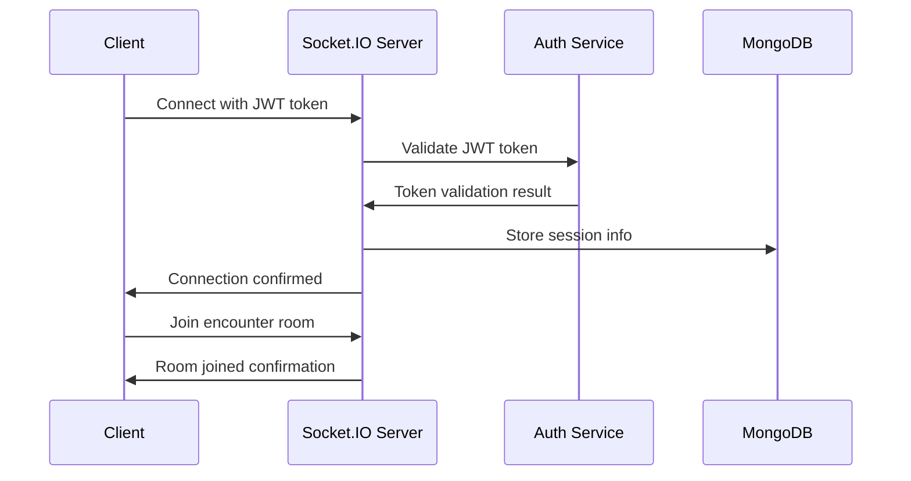

# Real-time Features

## Socket.IO Implementation

The D&D Encounter Tracker implements real-time collaboration features using Socket.IO for seamless multi-user encounter tracking and live updates during gameplay sessions.

## Architecture Overview

### WebSocket Connection Flow


## Server-Side Socket Implementation

### Socket.IO Server Configuration
```typescript
import { Server } from 'socket.io';
import { createAdapter } from '@socket.io/redis-adapter';
import { createClient } from 'redis';

class SocketServer {
  private io: Server;
  private redisAdapter: any;
  
  constructor(server: any) {
    this.io = new Server(server, {
      cors: {
        origin: process.env.FRONTEND_URL,
        methods: ['GET', 'POST'],
        credentials: true
      },
      transports: ['websocket', 'polling']
    });
    
    this.setupRedisAdapter();
    this.setupMiddleware();
    this.setupEventHandlers();
  }
  
  private async setupRedisAdapter() {
    if (process.env.REDIS_URL) {
      const pubClient = createClient({ url: process.env.REDIS_URL });
      const subClient = pubClient.duplicate();
      
      await Promise.all([pubClient.connect(), subClient.connect()]);
      
      this.redisAdapter = createAdapter(pubClient, subClient);
      this.io.adapter(this.redisAdapter);
    }
  }
  
  private setupMiddleware() {
    // Authentication middleware
    this.io.use(async (socket, next) => {
      try {
        const token = socket.handshake.auth.token;
        
        if (!token) {
          return next(new Error('Authentication token required'));
        }
        
        const decoded = tokenService.verifyAccessToken(token);
        const user = await User.findById(decoded.userId);
        
        if (!user) {
          return next(new Error('User not found'));
        }
        
        socket.userId = user._id.toString();
        socket.user = user;
        
        next();
      } catch (error) {
        next(new Error('Authentication failed'));
      }
    });
  }
  
  private setupEventHandlers() {
    this.io.on('connection', (socket) => {
      console.log(`User ${socket.userId} connected`);
      
      // Store session information
      this.storeSession(socket);
      
      // Set up event handlers
      this.setupEncounterEvents(socket);
      this.setupPartyEvents(socket);
      this.setupDisconnectionHandlers(socket);
    });
  }
}
```

### Session Management
```typescript
interface SocketSession {
  _id: ObjectId;
  userId: ObjectId;
  socketId: string;
  encounterId?: ObjectId;
  isActive: boolean;
  lastActivity: Date;
  ipAddress: string;
  userAgent: string;
}

class SessionManager {
  async storeSession(socket: Socket): Promise<void> {
    await Session.create({
      userId: new mongoose.Types.ObjectId(socket.userId),
      socketId: socket.id,
      isActive: true,
      lastActivity: new Date(),
      ipAddress: socket.handshake.address,
      userAgent: socket.handshake.headers['user-agent']
    });
  }
  
  async updateSessionActivity(socketId: string): Promise<void> {
    await Session.findOneAndUpdate(
      { socketId, isActive: true },
      { lastActivity: new Date() }
    );
  }
  
  async removeSession(socketId: string): Promise<void> {
    await Session.findOneAndUpdate(
      { socketId },
      { isActive: false }
    );
  }
  
  async getActiveSessionsForUser(userId: string): Promise<Session[]> {
    return Session.find({
      userId: new mongoose.Types.ObjectId(userId),
      isActive: true
    });
  }
}
```

## Encounter Real-time Events

### Encounter Event Handlers
```typescript
class EncounterSocketHandler {
  setupEncounterEvents(socket: Socket) {
    // Join encounter room
    socket.on('join_encounter', async (data: { encounterId: string }) => {
      try {
        const encounter = await Encounter.findOne({
          _id: data.encounterId,
          $or: [
            { userId: socket.userId },
            { 'participants.collaborators': socket.userId }
          ]
        });
        
        if (!encounter) {
          socket.emit('error', { message: 'Encounter not found or access denied' });
          return;
        }
        
        // Leave any previous encounter rooms
        const rooms = Array.from(socket.rooms);
        rooms.forEach(room => {
          if (room.startsWith('encounter_')) {
            socket.leave(room);
          }
        });
        
        // Join new encounter room
        const roomName = `encounter_${data.encounterId}`;
        socket.join(roomName);
        
        // Update session with current encounter
        await Session.findOneAndUpdate(
          { socketId: socket.id },
          { encounterId: new mongoose.Types.ObjectId(data.encounterId) }
        );
        
        // Notify others in the room
        socket.to(roomName).emit('user_joined_encounter', {
          userId: socket.userId,
          username: socket.user.username
        });
        
        // Send current encounter state
        socket.emit('encounter_state', {
          encounter: encounter,
          activeUsers: await this.getActiveUsersInRoom(roomName)
        });
        
      } catch (error) {
        socket.emit('error', { message: 'Failed to join encounter' });
      }
    });
    
    // Leave encounter room
    socket.on('leave_encounter', async (data: { encounterId: string }) => {
      const roomName = `encounter_${data.encounterId}`;
      socket.leave(roomName);
      
      // Update session
      await Session.findOneAndUpdate(
        { socketId: socket.id },
        { $unset: { encounterId: 1 } }
      );
      
      // Notify others
      socket.to(roomName).emit('user_left_encounter', {
        userId: socket.userId,
        username: socket.user.username
      });
    });
    
    // Handle HP changes
    socket.on('update_participant_hp', async (data: {
      encounterId: string;
      participantId: string;
      newHP: number;
      damage?: number;
      healing?: number;
      notes?: string;
    }) => {
      try {
        const encounter = await this.updateParticipantHP(
          data.encounterId,
          data.participantId,
          data.newHP,
          socket.userId
        );
        
        if (encounter) {
          const roomName = `encounter_${data.encounterId}`;
          
          // Broadcast HP change to all users in room
          this.io.to(roomName).emit('participant_hp_changed', {
            participantId: data.participantId,
            newHP: data.newHP,
            damage: data.damage,
            healing: data.healing,
            updatedBy: socket.user.username,
            timestamp: new Date()
          });
          
          // Log combat action if premium feature
          if (socket.user.features.advancedCombatLog) {
            await this.logCombatAction(data.encounterId, {
              action: data.damage ? 'damage' : 'healing',
              participantId: data.participantId,
              amount: data.damage || data.healing,
              description: data.notes || (data.damage ? 'Damage taken' : 'Healing received'),
              performedBy: socket.userId
            });
          }
        }
      } catch (error) {
        socket.emit('error', { message: 'Failed to update HP' });
      }
    });
    
    // Handle turn advancement
    socket.on('advance_turn', async (data: { encounterId: string }) => {
      try {
        const encounter = await this.advanceTurn(data.encounterId, socket.userId);
        
        if (encounter) {
          const roomName = `encounter_${data.encounterId}`;
          
          this.io.to(roomName).emit('turn_advanced', {
            currentTurn: encounter.currentTurn,
            round: encounter.round,
            currentParticipant: encounter.participants[encounter.currentTurn],
            advancedBy: socket.user.username,
            timestamp: new Date()
          });
        }
      } catch (error) {
        socket.emit('error', { message: 'Failed to advance turn' });
      }
    });
    
    // Handle initiative rolls
    socket.on('roll_initiative', async (data: {
      encounterId: string;
      participantId: string;
      roll: number;
    }) => {
      try {
        const encounter = await this.updateInitiative(
          data.encounterId,
          data.participantId,
          data.roll,
          socket.userId
        );
        
        if (encounter) {
          const roomName = `encounter_${data.encounterId}`;
          
          this.io.to(roomName).emit('initiative_updated', {
            participantId: data.participantId,
            initiativeRoll: data.roll,
            newOrder: encounter.participants.map(p => ({
              id: p._id,
              name: p.name,
              initiative: p.initiativeRoll,
              order: p.initiativeOrder
            })),
            rolledBy: socket.user.username,
            timestamp: new Date()
          });
        }
      } catch (error) {
        socket.emit('error', { message: 'Failed to update initiative' });
      }
    });
    
    // Handle condition management
    socket.on('add_condition', async (data: {
      encounterId: string;
      participantId: string;
      condition: {
        name: string;
        duration: number;
        description?: string;
      };
    }) => {
      try {
        const encounter = await this.addCondition(
          data.encounterId,
          data.participantId,
          data.condition,
          socket.userId
        );
        
        if (encounter) {
          const roomName = `encounter_${data.encounterId}`;
          
          this.io.to(roomName).emit('condition_added', {
            participantId: data.participantId,
            condition: data.condition,
            addedBy: socket.user.username,
            timestamp: new Date()
          });
        }
      } catch (error) {
        socket.emit('error', { message: 'Failed to add condition' });
      }
    });
  }
  
  private async updateParticipantHP(
    encounterId: string,
    participantId: string,
    newHP: number,
    userId: string
  ): Promise<Encounter | null> {
    const encounter = await Encounter.findOneAndUpdate(
      {
        _id: encounterId,
        'participants._id': participantId,
        $or: [
          { userId },
          { 'participants.collaborators': userId }
        ]
      },
      {
        $set: {
          'participants.$.currentHP': Math.max(0, newHP),
          updatedAt: new Date()
        }
      },
      { new: true }
    );
    
    return encounter;
  }
  
  private async advanceTurn(encounterId: string, userId: string): Promise<Encounter | null> {
    const encounter = await Encounter.findOne({
      _id: encounterId,
      $or: [
        { userId },
        { 'participants.collaborators': userId }
      ]
    });
    
    if (!encounter) return null;
    
    let nextTurn = encounter.currentTurn + 1;
    let nextRound = encounter.round;
    
    // Check if we need to advance to next round
    if (nextTurn >= encounter.participants.length) {
      nextTurn = 0;
      nextRound += 1;
      
      // Process end-of-round effects (e.g., condition duration)
      await this.processEndOfRound(encounter);
    }
    
    encounter.currentTurn =