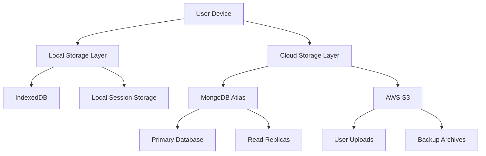

# Data Persistence Strategy

## Multi-Tier Data Storage Architecture

The D&D Encounter Tracker implements a sophisticated data persistence strategy that combines local storage for free users with cloud synchronization for premium subscribers, ensuring data availability across devices and sessions.

## Storage Architecture Overview

### Storage Layers


## Local Storage Implementation

### IndexedDB for Offline Functionality
```typescript
interface LocalStorageSchema {
  parties: Party[];
  encounters: Encounter[];
  creatures: Creature[];
  userPreferences: UserPreferences;
  syncQueue: SyncQueueItem[];
  lastSync: Date;
}

class LocalStorageService {
  private db: IDBDatabase | null = null;
  private readonly DB_NAME = 'dnd-tracker-local';
  private readonly DB_VERSION = 1;
  
  async initialize(): Promise<void> {
    return new Promise((resolve, reject) => {
      const request = indexedDB.open(this.DB_NAME, this.DB_VERSION);
      
      request.onerror = () => reject(request.error);
      request.onsuccess = () => {
        this.db = request.result;
        resolve();
      };
      
      request.onupgradeneeded = (event) => {
        const db = (event.target as IDBOpenDBRequest).result;
        this.createObjectStores(db);
      };
    });
  }
  
  private createObjectStores(db: IDBDatabase): void {
    // Parties store
    if (!db.objectStoreNames.contains('parties')) {
      const partiesStore = db.createObjectStore('parties', { keyPath: 'id' });
      partiesStore.createIndex('userId', 'userId', { unique: false });
      partiesStore.createIndex('createdAt', 'createdAt', { unique: false });
    }
    
    // Encounters store
    if (!db.objectStoreNames.contains('encounters')) {
      const encountersStore = db.createObjectStore('encounters', { keyPath: 'id' });
      encountersStore.createIndex('userId', 'userId', { unique: false });
      encountersStore.createIndex('status', 'status', { unique: false });
      encountersStore.createIndex('updatedAt', 'updatedAt', { unique: false });
    }
    
    // Creatures store
    if (!db.objectStoreNames.contains('creatures')) {
      const creaturesStore = db.createObjectStore('creatures', { keyPath: 'id' });
      creaturesStore.createIndex('userId', 'userId', { unique: false });
      creaturesStore.createIndex('isTemplate', 'isTemplate', { unique: false });
    }
    
    // Sync queue store
    if (!db.objectStoreNames.contains('syncQueue')) {
      const syncStore = db.createObjectStore('syncQueue', { keyPath: 'id', autoIncrement: true });
      syncStore.createIndex('timestamp', 'timestamp', { unique: false });
      syncStore.createIndex('operation', 'operation', { unique: false });
    }
    
    // User preferences store
    if (!db.objectStoreNames.contains('userPreferences')) {
      db.createObjectStore('userPreferences', { keyPath: 'userId' });
    }
  }
  
  async saveData<T>(storeName: string, data: T): Promise<void> {
    return new Promise((resolve, reject) => {
      if (!this.db) {
        reject(new Error('Database not initialized'));
        return;
      }
      
      const transaction = this.db.transaction([storeName], 'readwrite');
      const store = transaction.objectStore(storeName);
      const request = store.put(data);
      
      request.onerror = () => reject(request.error);
      request.onsuccess = () => resolve();
    });
  }
  
  async getData<T>(storeName: string, id: string): Promise<T | null> {
    return new Promise((resolve, reject) => {
      if (!this.db) {
        reject(new Error('Database not initialized'));
        return;
      }
      
      const transaction = this.db.transaction([storeName], 'readonly');
      const store = transaction.objectStore(storeName);
      const request = store.get(id);
      
      request.onerror = () => reject(request.error);
      request.onsuccess = () => resolve(request.result || null);
    });
  }
  
  async getAllData<T>(storeName: string, userId?: string): Promise<T[]> {
    return new Promise((resolve, reject) => {
      if (!this.db) {
        reject(new Error('Database not initialized'));
        return;
      }
      
      const transaction = this.db.transaction([storeName], 'readonly');
      const store = transaction.objectStore(storeName);
      
      let request: IDBRequest;
      if (userId) {
        const index = store.index('userId');
        request = index.getAll(userId);
      } else {
        request = store.getAll();
      }
      
      request.onerror = () => reject(request.error);
      request.onsuccess = () => resolve(request.result || []);
    });
  }
  
  async deleteData(storeName: string, id: string): Promise<void> {
    return new Promise((resolve, reject) => {
      if (!this.db) {
        reject(new Error('Database not initialized'));
        return;
      }
      
      const transaction = this.db.transaction([storeName], 'readwrite');
      const store = transaction.objectStore(storeName);
      const request = store.delete(id);
      
      request.onerror = () => reject(request.error);
      request.onsuccess = () => resolve();
    });
  }
}
```

### Sync Queue Management
```typescript
interface SyncQueueItem {
  id?: number;
  operation: 'CREATE' | 'UPDATE' | 'DELETE';
  resourceType: 'party' | 'encounter' | 'creature';
  resourceId: string;
  data?: any;
  timestamp: Date;
  retryCount: number;
  lastError?: string;
}

class SyncQueueService {
  private localStorage: LocalStorageService;
  private maxRetries = 3;
  
  constructor(localStorage: LocalStorageService) {
    this.localStorage = localStorage;
  }
  
  async addToQueue(item: Omit<SyncQueueItem, 'id' | 'timestamp' | 'retryCount'>): Promise<void> {
    const queueItem: SyncQueueItem = {
      ...item,
      timestamp: new Date(),
      retryCount: 0
    };
    
    await this.localStorage.saveData('syncQueue', queueItem);
  }
  
  async getQueueItems(): Promise<SyncQueueItem[]> {
    return this.localStorage.getAllData<SyncQueueItem>('syncQueue');
  }
  
  async removeFromQueue(id: number): Promise<void> {
    await this.localStorage.deleteData('syncQueue', id.toString());
  }
  
  async incrementRetryCount(id: number, error: string): Promise<void> {
    const item = await this.localStorage.getData<SyncQueueItem>('syncQueue', id.toString());
    if (item) {
      item.retryCount += 1;
      item.lastError = error;
      await this.localStorage.saveData('syncQueue', item);
    }
  }
  
  async clearQueue(): Promise<void> {
    const items = await this.getQueueItems();
    for (const item of items) {
      if (item.id) {
        await this.removeFromQueue(item.id);
      }
    }
  }
}
```

## Cloud Synchronization

### Sync Service Implementation
```typescript
class CloudSyncService {
  private localStorage: LocalStorageService;
  private syncQueue: SyncQueueService;
  private apiService: ApiService;
  private isOnline: boolean = navigator.onLine;
  
  constructor() {
    this.localStorage = new LocalStorageService();
    this.syncQueue = new SyncQueueService(this.localStorage);
    this.apiService = new ApiService();
    
    this.setupOnlineStatusListeners();
    this.schedulePeriodicSync();
  }
  
  private setupOnlineStatusListeners(): void {
    window.addEventListener('online', () => {
      this.isOnline = true;
      this.performSync();
    });
    
    window.addEventListener('offline', () => {
      this.isOnline = false;
    });
  }
  
  private schedulePeriodicSync(): void {
    // Sync every 5 minutes when online
    setInterval(() => {
      if (this.isOnline) {
        this.performSync();
      }
    }, 5 * 60 * 1000);
  }
  
  async performSync(): Promise<SyncResult> {
    if (!this.isOnline) {
      return { success: false, error: 'Device is offline' };
    }
    
    try {
      // 1. Push local changes to cloud
      await this.pushLocalChanges();
      
      // 2. Pull remote changes from cloud
      await this.pullRemoteChanges();
      
      // 3. Resolve conflicts if any
      await this.resolveConflicts();
      
      return { success: true };
    } catch (error) {
      console.error('Sync failed:', error);
      return { success: false, error: error.message };
    }
  }
  
  private async pushLocalChanges(): Promise<void> {
    const queueItems = await this.syncQueue.getQueueItems();
    
    for (const item of queueItems) {
      try {
        switch (item.operation) {
          case 'CREATE':
            await this.apiService.post(`/${item.resourceType}s`, item.data);
            break;
          case 'UPDATE':
            await this.apiService.put(`/${item.resourceType}s/${item.resourceId}`, item.data);
            break;
          case 'DELETE':
            await this.apiService.delete(`/${item.resourceType}s/${item.resourceId}`);
            break;
        }
        
        // Remove from queue on success
        if (item.id) {
          await this.syncQueue.removeFromQueue(item.id);
        }
      } catch (error) {
        if (item.retryCount < this.syncQueue.maxRetries && item.id) {
          await this.syncQueue.incrementRetryCount(item.id, error.message);
        } else {
          // Max retries reached, remove from queue and log error
          console.error(`Failed to sync ${item.resourceType} ${item.resourceId}:`, error);
          if (item.id) {
            await this.syncQueue.removeFromQueue(item.id);
          }
        }
      }
    }
  }
  
  private async pullRemoteChanges(): Promise<void> {
    const lastSync = await this.getLastSyncTime();
    
    // Fetch changes since last sync
    const changes = await this.apiService.get('/sync/changes', {
      params: { since: lastSync.toISOString() }
    });
    
    // Apply changes to local storage
    for (const change of changes.data) {
      switch (change.operation) {
        case 'CREATE':
        case 'UPDATE':
          await this.localStorage.saveData(change.resourceType + 's', change.data);
          break;
        case 'DELETE':
          await this.localStorage.deleteData(change.resourceType + 's', change.resourceId);
          break;
      }
    }
    
    // Update last sync time
    await this.updateLastSyncTime(new Date());
  }
  
  private async resolveConflicts(): Promise<void> {
    // Implement conflict resolution strategy
    // For this app, we'll use "server wins" for simplicity
    // More sophisticated conflict resolution could be implemented based on timestamps
  }
  
  private async getLastSyncTime(): Promise<Date> {
    const prefs = await this.localStorage.getData<{ lastSync: string }>('userPreferences', 'sync');
    return prefs?.lastSync ? new Date(prefs.lastSync) : new Date(0);
  }
  
  private async updateLastSyncTime(time: Date): Promise<void> {
    await this.localStorage.saveData('userPreferences', {
      userId: 'sync',
      lastSync: time.toISOString()
    });
  }
}
```

## Backup and Recovery System

### Automated Backup Service
```typescript
class BackupService {
  private s3Client: AWS.S3;
  private backupBucket: string;
  
  constructor() {
    this.s3Client = new AWS.S3({
      accessKeyId: process.env.AWS_ACCESS_KEY_ID,
      secretAccessKey: process.env.AWS_SECRET_ACCESS_KEY,
      region: process.env.AWS_REGION
    });
    this.backupBucket = process.env.AWS_S3_BACKUP_BUCKET!;
  }
  
  async createUserBackup(userId: string): Promise<string> {
    try {
      // Gather all user data
      const userData = await this.gatherUserData(userId);
      
      // Create backup archive
      const backupData = {
        userId,
        createdAt: new Date(),
        version: '1.0',
        data: userData
      };
      
      // Generate backup filename
      const timestamp = new Date().toISOString().replace(/[:.]/g, '-');
      const backupKey = `backups/${userId}/${timestamp}.json`;
      
      // Upload to S3
      await this.s3Client.upload({
        Bucket: this.backupBucket,
        Key: backupKey,
        Body: JSON.stringify(backupData, null, 2),
        ContentType: 'application/json',
        ServerSideEncryption: 'AES256'
      }).promise();
      
      // Store backup metadata in database
      await BackupRecord.create({
        userId: new mongoose.Types.ObjectId(userId),
        backupKey,
        size: JSON.stringify(backupData).length,
        createdAt: new Date()
      });
      
      return backupKey;
    } catch (error) {
      console.error('Backup creation failed:', error);
      throw new Error('Failed to create backup');
    }
  }
  
  private async gatherUserData(userId: string): Promise<any> {
    const [user, parties, encounters, creatures] = await Promise.all([
      User.findById(userId).select('-passwordHash'),
      Party.find({ userId }),
      Encounter.find({ userId }),
      Creature.find({ userId })
    ]);
    
    return {
      user,
      parties,
      encounters,
      creatures
    };
  }
  
  async restoreUserBackup(userId: string, backupKey: string): Promise<void> {
    try {
      // Download backup from S3
      const backup = await this.s3Client.getObject({
        Bucket: this.backupBucket,
        Key: backupKey
      }).promise();
      
      if (!backup.Body) {
        throw new Error('Backup file not found');
      }
      
      const backupData = JSON.parse(backup.Body.toString());
      
      // Verify backup belongs to user
      if (backupData.userId !== userId) {
        throw new Error('Backup does not belong to user');
      }
      
      // Restore data (this would be more sophisticated in practice)
      await this.restoreUserData(userId, backupData.data);
      
    } catch (error) {
      console.error('Backup restoration failed:', error);
      throw new Error('Failed to restore backup');
    }
  }
  
  private async restoreUserData(userId: string, data: any): Promise<void> {
    // This is a simplified restoration process
    // In practice, you'd want more sophisticated conflict resolution
    
    const session = await mongoose.startSession();
    session.startTransaction();
    
    try {
      // Clear existing data
      await Promise.all([
        Party.deleteMany({ userId }).session(session),
        Encounter.deleteMany({ userId }).session(session),
        Creature.deleteMany({ userId }).session(session)
      ]);
      
      // Restore data
      if (data.parties?.length) {
        await Party.insertMany(data.parties, { session });
      }
      if (data.encounters?.length) {
        await Encounter.insertMany(data.encounters, { session });
      }
      if (data.creatures?.length) {
        await Creature.insertMany(data.creatures, { session });
      }
      
      await session.commitTransaction();
    } catch (error) {
      await session.abortTransaction();
      throw error;
    } finally {
      session.endSession();
    }
  }
  
  async scheduleBackups(): Promise<void> {
    // Get all premium users who have automated backups enabled
    const users = await User.find({
      'features.automatedBackups': true,
      'subscription.status': 'active'
    });
    
    for (const user of users) {
      try {
        await this.createUserBackup(user._id.toString());
      } catch (error) {
        console.error(`Backup failed for user ${user._id}:`, error);
      }
    }
  }
  
  async cleanupOldBackups(): Promise<void> {
    const thirtyDaysAgo = new Date();
    thirtyDaysAgo.setDate(thirtyDaysAgo.getDate() - 30);
    
    // Find old backup records
    const oldBackups = await BackupRecord.find({
      createdAt: { $lt: thirtyDaysAgo }
    });
    
    // Delete from S3 and database
    for (const backup of oldBackups) {
      try {
        await this.s3Client.deleteObject({
          Bucket: this.backupBucket,
          Key: backup.backupKey
        }).promise();
        
        await BackupRecord.findByIdAndDelete(backup._id);
      } catch (error) {
        console.error(`Failed to cleanup backup ${backup.backupKey}:`, error);
      }
    }
  }
}
```

## Data Export and Import

### GDPR Compliance Data Export
```typescript
class DataExportService {
  async exportUserData(userId: string, format: 'json' | 'csv' = 'json'): Promise<Buffer> {
    const userData = await this.gatherAllUserData(userId);
    
    switch (format) {
      case 'json':
        return Buffer.from(JSON.stringify(userData, null, 2));
      case 'csv':
        return this.convertToCSV(userData);
      default:
        throw new Error('Unsupported export format');
    }
  }
  
  private async gatherAllUserData(userId: string): Promise<any> {
    const [
      user,
      parties,
      encounters,
      creatures,
      transactions,
      sessions,
      adminActions
    ] = await Promise.all([
      User.findById(userId).select('-passwordHash'),
      Party.find({ userId }),
      Encounter.find({ userId }),
      Creature.find({ userId }),
      PaymentTransaction.find({ userId }),
      Session.find({ userId }),
      AdminAction.find({ targetUserId: userId })
    ]);
    
    return {
      exportDate: new Date(),
      user,
      parties,
      encounters,
      creatures,
      paymentHistory: transactions,
      sessionHistory: sessions,
      adminActions
    };
  }
  
  private convertToCSV(data: any): Buffer {
    // Implement CSV conversion logic
    // This would flatten the nested data structure into CSV format
    const csv = this.flattenDataToCSV(data);
    return Buffer.from(csv);
  }
  
  async importUserData(userId: string, importData: any): Promise<void> {
    // Validate import data structure
    this.validateImportData(importData);
    
    const session = await mongoose.startSession();
    session.startTransaction();
    
    try {
      // Import parties
      if (importData.parties) {
        for (const party of importData.parties) {
          party.userId = new mongoose.Types.ObjectId(userId);
          delete party._id; // Remove old ID
          await Party.create([party], { session });
        }
      }
      
      // Import encounters
      if (importData.encounters) {
        for (const encounter of importData.encounters) {
          encounter.userId = new mongoose.Types.ObjectId(userId);
          delete encounter._id;
          await Encounter.create([encounter], { session });
        }
      }
      
      // Import creatures
      if (importData.creatures) {
        for (const creature of importData.creatures) {
          creature.userId = new mongoose.Types.ObjectId(userId);
          delete creature._id;
          await Creature.create([creature], { session });
        }
      }
      
      await session.commitTransaction();
    } catch (error) {
      await session.abortTransaction();
      throw error;
    } finally {
      session.endSession();
    }
  }
  
  private validateImportData(data: any): void {
    // Implement validation logic for import data
    if (!data || typeof data !== 'object') {
      throw new Error('Invalid import data format');
    }
    
    // Additional validation rules...
  }
}
```

## Frontend Data Management

### Offline-First Data Layer
```typescript
class DataManager {
  private localStorage: LocalStorageService;
  private cloudSync: CloudSyncService;
  private isOnline: boolean = navigator.onLine;
  
  constructor() {
    this.localStorage = new LocalStorageService();
    this.cloudSync = new CloudSyncService();
    
    this.setupOnlineStatusHandling();
  }
  
  async saveParty(party: Party): Promise<Party> {
    // Always save to local storage first
    await this.localStorage.saveData('parties', party);
    
    // Queue for sync if online
    if (this.isOnline) {
      try {
        const response = await this.apiService.post('/parties', party);
        return response.data;
      } catch (error) {
        // If API call fails, queue for later sync
        await this.cloudSync.syncQueue.addToQueue({
          operation: 'CREATE',
          resourceType: 'party',
          resourceId: party.id,
          data: party
        });
        return party;
      }
    } else {
      // Queue for sync when back online
      await this.cloudSync.syncQueue.addToQueue({
        operation: 'CREATE',
        resourceType: 'party',
        resourceId: party.id,
        data: party
      });
      return party;
    }
  }
  
  async getParties(userId: string): Promise<Party[]> {
    if (this.isOnline) {
      try {
        // Try to get fresh data from API
        const response = await this.apiService.get('/parties');
        const parties = response.data.parties;
        
        // Update local storage with fresh data
        for (const party of parties) {
          await this.localStorage.saveData('parties', party);
        }
        
        return parties;
      } catch (error) {
        // Fall back to local storage
        console.warn('API unavailable, using local data');
        return this.localStorage.getAllData('parties', userId);
      }
    } else {
      // Use local storage when offline
      return this.localStorage.getAllData('parties', userId);
    }
  }
  
  private setupOnlineStatusHandling(): void {
    window.addEventListener('online', () => {
      this.isOnline = true;
      this.cloudSync.performSync();
    });
    
    window.addEventListener('offline', () => {
      this.isOnline = false;
    });
  }
}
```

## Storage Quotas and Management

### Storage Quota Monitoring
```typescript
class StorageQuotaManager {
  async checkStorageQuota(): Promise<StorageQuota> {
    if ('storage' in navigator && 'estimate' in navigator.storage) {
      const estimate = await navigator.storage.estimate();
      
      return {
        used: estimate.usage || 0,
        available: estimate.quota || 0,
        percentage: estimate.quota ? (estimate.usage! / estimate.quota) * 100 : 0
      };
    }
    
    return { used: 0, available: 0, percentage: 0 };
  }
  
  async cleanupOldData(): Promise<void> {
    const quota = await this.checkStorageQuota();
    
    // If using more than 80% of available storage, cleanup old data
    if (quota.percentage > 80) {
      await this.performCleanup();
    }
  }
  
  private async performCleanup(): Promise<void> {
    // Remove old completed encounters
    const thirtyDaysAgo = new Date();
    thirtyDaysAgo.setDate(thirtyDaysAgo.getDate() - 30);
    
    // This would implement IndexedDB cleanup logic
    console.log('Performing storage cleanup...');
  }
}
```

This data persistence strategy ensures reliable data storage and synchronization across devices while providing offline functionality for free users and seamless cloud sync for premium subscribers, with comprehensive backup and recovery capabilities.