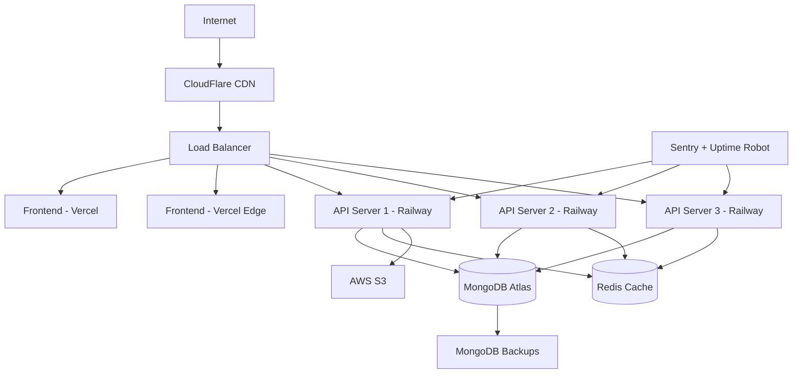

# Deployment Architecture

## Cloud Infrastructure Overview

The D&D Encounter Tracker utilizes a modern, scalable cloud architecture designed for high availability, performance, and cost efficiency across development, staging, and production environments.

## Infrastructure Architecture

### Production Environment Architecture


## Environment Configuration

### Development Environment
```yaml
# docker-compose.dev.yml
version: '3.8'
services:
  frontend:
    build:
      context: ./frontend
      dockerfile: Dockerfile.dev
    ports:
      - "3000:3000"
    volumes:
      - ./frontend:/app
      - /app/node_modules
    environment:
      - VITE_API_BASE_URL=http://localhost:3001/api/v1
      - VITE_SOCKET_URL=http://localhost:3001
    depends_on:
      - backend

  backend:
    build:
      context: ./backend
      dockerfile: Dockerfile.dev
    ports:
      - "3001:3001"
    volumes:
      - ./backend:/app
      - /app/node_modules
    environment:
      - NODE_ENV=development
      - PORT=3001
      - MONGODB_URI=mongodb://mongo:27017/dnd_encounter_tracker
      - JWT_SECRET=dev_jwt_secret
      - REDIS_URL=redis://redis:6379
    depends_on:
      - mongo
      - redis

  mongo:
    image: mongo:7.0
    ports:
      - "27017:27017"
    volumes:
      - mongo_data:/data/db
    environment:
      - MONGO_INITDB_DATABASE=dnd_encounter_tracker

  redis:
    image: redis:7.2-alpine
    ports:
      - "6379:6379"
    volumes:
      - redis_data:/data

volumes:
  mongo_data:
  redis_data:
```

### Production Environment Variables
```typescript
// Environment configuration service
class EnvironmentConfig {
  static readonly environments = ['development', 'staging', 'production'] as const;
  
  private static config = {
    development: {
      database: {
        uri: 'mongodb://localhost:27017/dnd_tracker_dev',
        options: {
          retryWrites: true,
          w: 'majority'
        }
      },
      redis: {
        url: 'redis://localhost:6379',
        options: {
          retryDelayOnFailover: 100,
          maxRetriesPerRequest: 3
        }
      },
      cors: {
        origins: ['http://localhost:3000'],
        credentials: true
      }
    },
    
    staging: {
      database: {
        uri: process.env.MONGODB_URI_STAGING!,
        options: {
          retryWrites: true,
          w: 'majority',
          ssl: true
        }
      },
      redis: {
        url: process.env.REDIS_URL_STAGING!,
        options: {
          retryDelayOnFailover: 100,
          maxRetriesPerRequest: 3,
          tls: {}
        }
      },
      cors: {
        origins: ['https://staging.dndtracker.com'],
        credentials: true
      }
    },
    
    production: {
      database: {
        uri: process.env.MONGODB_URI!,
        options: {
          retryWrites: true,
          w: 'majority',
          ssl: true,
          authMechanism: 'SCRAM-SHA-256'
        }
      },
      redis: {
        url: process.env.REDIS_URL!,
        options: {
          retryDelayOnFailover: 100,
          maxRetriesPerRequest: 3,
          tls: {}
        }
      },
      cors: {
        origins: ['https://dndtracker.com', 'https://www.dndtracker.com'],
        credentials: true
      }
    }
  };
  
  static get(key: string): any {
    const env = process.env.NODE_ENV as keyof typeof this.config || 'development';
    return this.config[env]?.[key];
  }
  
  static validate(): void {
    const required = [
      'MONGODB_URI',
      'JWT_SECRET',
      'JWT_REFRESH_SECRET',
      'STRIPE_SECRET_KEY',
      'ENCRYPTION_SECRET'
    ];
    
    const missing = required.filter(key => !process.env[key]);
    
    if (missing.length > 0) {
      throw new Error(`Missing required environment variables: ${missing.join(', ')}`);
    }
  }
}
```

## CI/CD Pipeline

### GitHub Actions Workflow
```yaml
# .github/workflows/ci-cd.yml
name: CI/CD Pipeline

on:
  push:
    branches: [main, develop]
  pull_request:
    branches: [main]

env:
  NODE_VERSION: '20'
  REGISTRY: ghcr.io
  IMAGE_NAME: ${{ github.repository }}

jobs:
  test:
    runs-on: ubuntu-latest
    
    services:
      mongodb:
        image: mongo:7.0
        ports:
          - 27017:27017
      redis:
        image: redis:7.2
        ports:
          - 6379:6379
    
    steps:
      - name: Checkout code
        uses: actions/checkout@v4
      
      - name: Setup Node.js
        uses: actions/setup-node@v4
        with:
          node-version: ${{ env.NODE_VERSION }}
          cache: 'npm'
      
      - name: Install dependencies
        run: npm ci
      
      - name: Lint code
        run: |
          npm run lint:frontend
          npm run lint:backend
      
      - name: Type check
        run: |
          npm run type-check:frontend
          npm run type-check:backend
      
      - name: Run tests
        run: |
          npm run test:backend
          npm run test:frontend
        env:
          MONGODB_URI: mongodb://localhost:27017/dnd_tracker_test
          REDIS_URL: redis://localhost:6379
          JWT_SECRET: test_secret
          NODE_ENV: test
      
      - name: Build applications
        run: |
          npm run build:frontend
          npm run build:backend
      
      - name: Upload coverage reports
        uses: codecov/codecov-action@v3
        with:
          files: ./coverage/lcov.info

  security-scan:
    runs-on: ubuntu-latest
    steps:
      - name: Checkout code
        uses: actions/checkout@v4
      
      - name: Run security audit
        run: npm audit --audit-level moderate
      
      - name: Run Snyk security scan
        uses: snyk/actions/node@master
        env:
          SNYK_TOKEN: ${{ secrets.SNYK_TOKEN }}

  deploy-staging:
    needs: [test, security-scan]
    runs-on: ubuntu-latest
    if: github.ref == 'refs/heads/develop'
    
    steps:
      - name: Checkout code
        uses: actions/checkout@v4
      
      - name: Deploy to Railway (Staging)
        uses: railway-app/actions@v1
        with:
          api-token: ${{ secrets.RAILWAY_TOKEN_STAGING }}
          project-id: ${{ secrets.RAILWAY_PROJECT_ID_STAGING }}
          service-name: backend
      
      - name: Deploy to Vercel (Staging)
        uses: amondnet/vercel-action@v25
        with:
          vercel-token: ${{ secrets.VERCEL_TOKEN }}
          vercel-org-id: ${{ secrets.VERCEL_ORG_ID }}
          vercel-project-id: ${{ secrets.VERCEL_PROJECT_ID }}
          vercel-args: '--prod --env staging'
          working-directory: ./frontend

  deploy-production:
    needs: [test, security-scan]
    runs-on: ubuntu-latest
    if: github.ref == 'refs/heads/main'
    environment: production
    
    steps:
      - name: Checkout code
        uses: actions/checkout@v4
      
      - name: Deploy to Railway (Production)
        uses: railway-app/actions@v1
        with:
          api-token: ${{ secrets.RAILWAY_TOKEN_PRODUCTION }}
          project-id: ${{ secrets.RAILWAY_PROJECT_ID_PRODUCTION }}
          service-name: backend
      
      - name: Deploy to Vercel (Production)
        uses: amondnet/vercel-action@v25
        with:
          vercel-token: ${{ secrets.VERCEL_TOKEN }}
          vercel-org-id: ${{ secrets.VERCEL_ORG_ID }}
          vercel-project-id: ${{ secrets.VERCEL_PROJECT_ID }}
          vercel-args: '--prod'
          working-directory: ./frontend
      
      - name: Run post-deployment tests
        run: npm run test:e2e
        env:
          BASE_URL: https://dndtracker.com
      
      - name: Notify deployment
        uses: 8398a7/action-slack@v3
        with:
          status: ${{ job.status }}
          channel: '#deployments'
        env:
          SLACK_WEBHOOK_URL: ${{ secrets.SLACK_WEBHOOK_URL }}
```

### Database Migration Pipeline
```typescript
// Database migration system
class MigrationRunner {
  private migrations: Migration[] = [];
  
  constructor() {
    this.loadMigrations();
  }
  
  private loadMigrations(): void {
    // Load migration files dynamically
    const migrationFiles = glob.sync('./migrations/*.ts');
    
    this.migrations = migrationFiles
      .map(file => require(path.resolve(file)).default)
      .sort((a, b) => a.version.localeCompare(b.version));
  }
  
  async runMigrations(): Promise<void> {
    const appliedMigrations = await MigrationRecord.find({}).sort({ version: 1 });
    const appliedVersions = new Set(appliedMigrations.map(m => m.version));
    
    for (const migration of this.migrations) {
      if (!appliedVersions.has(migration.version)) {
        console.log(`Running migration ${migration.version}: ${migration.description}`);
        
        const session = await mongoose.startSession();
        session.startTransaction();
        
        try {
          await migration.up(session);
          
          await MigrationRecord.create([{
            version: migration.version,
            description: migration.description,
            appliedAt: new Date()
          }], { session });
          
          await session.commitTransaction();
          console.log(`Migration ${migration.version} completed successfully`);
        } catch (error) {
          await session.abortTransaction();
          console.error(`Migration ${migration.version} failed:`, error);
          throw error;
        } finally {
          session.endSession();
        }
      }
    }
  }
  
  async rollbackMigration(version: string): Promise<void> {
    const migration = this.migrations.find(m => m.version === version);
    if (!migration || !migration.down) {
      throw new Error(`Migration ${version} not found or not reversible`);
    }
    
    const session = await mongoose.startSession();
    session.startTransaction();
    
    try {
      await migration.down(session);
      await MigrationRecord.deleteOne({ version });
      await session.commitTransaction();
      console.log(`Migration ${version} rolled back successfully`);
    } catch (error) {
      await session.abortTransaction();
      throw error;
    } finally {
      session.endSession();
    }
  }
}

interface Migration {
  version: string;
  description: string;
  up(session: mongoose.ClientSession): Promise<void>;
  down?(session: mongoose.ClientSession): Promise<void>;
}
```

## Monitoring and Alerting

### Application Monitoring Setup
```typescript
// Monitoring service configuration
class MonitoringService {
  private sentry: typeof Sentry;
  private metrics: any;
  
  constructor() {
    this.initializeSentry();
    this.initializeMetrics();
    this.setupHealthChecks();
  }
  
  private initializeSentry(): void {
    Sentry.init({
      dsn: process.env.SENTRY_DSN,
      environment: process.env.NODE_ENV,
      tracesSampleRate: process.env.NODE_ENV === 'production' ? 0.1 : 1.0,
      beforeSend(event) {
        // Filter out sensitive information
        if (event.request?.headers) {
          delete event.request.headers.authorization;
          delete event.request.headers.cookie;
        }
        return event;
      }
    });
  }
  
  private initializeMetrics(): void {
    // Custom metrics collection
    this.metrics = {
      httpRequests: new Map<string, number>(),
      errors: new Map<string, number>(),
      dbQueries: new Map<string, number>(),
      responseTime: new Map<string, number[]>()
    };
  }
  
  private setupHealthChecks(): void {
    setInterval(async () => {
      try {
        await this.performHealthCheck();
      } catch (error) {
        console.error('Health check failed:', error);
        Sentry.captureException(error);
      }
    }, 30000); // Every 30 seconds
  }
  
  async performHealthCheck(): Promise<HealthStatus> {
    const checks = await Promise.allSettled([
      this.checkDatabase(),
      this.checkRedis(),
      this.checkExternalServices()
    ]);
    
    const status: HealthStatus = {
      timestamp: new Date(),
      status: 'healthy',
      checks: {
        database: checks[0].status === 'fulfilled' ? 'healthy' : 'unhealthy',
        redis: checks[1].status === 'fulfilled' ? 'healthy' : 'unhealthy',
        external: checks[2].status === 'fulfilled' ? 'healthy' : 'unhealthy'
      }
    };
    
    if (Object.values(status.checks).some(check => check === 'unhealthy')) {
      status.status = 'unhealthy';
    }
    
    return status;
  }
  
  private async checkDatabase(): Promise<void> {
    await mongoose.connection.db.admin().ping();
  }
  
  private async checkRedis(): Promise<void> {
    if (redisClient.isOpen) {
      await redisClient.ping();
    }
  }
  
  private async checkExternalServices(): Promise<void> {
    // Check Stripe API
    await stripe.balance.retrieve();
  }
  
  trackRequest(method: string, path: string, duration: number, statusCode: number): void {
    const key = `${method} ${path}`;
    
    // Track request count
    this.metrics.httpRequests.set(key, (this.metrics.httpRequests.get(key) || 0) + 1);
    
    // Track response time
    if (!this.metrics.responseTime.has(key)) {
      this.metrics.responseTime.set(key, []);
    }
    this.metrics.responseTime.get(key)!.push(duration);
    
    // Track errors
    if (statusCode >= 400) {
      this.metrics.errors.set(key, (this.metrics.errors.get(key) || 0) + 1);
    }
  }
  
  getMetrics(): any {
    return {
      requests: Object.fromEntries(this.metrics.httpRequests),
      errors: Object.fromEntries(this.metrics.errors),
      avgResponseTime: Object.fromEntries(
        Array.from(this.metrics.responseTime.entries()).map(([key, times]) => [
          key,
          times.reduce((a, b) => a + b, 0) / times.length
        ])
      )
    };
  }
}

interface HealthStatus {
  timestamp: Date;
  status: 'healthy' | 'unhealthy';
  checks: {
    database: 'healthy' | 'unhealthy';
    redis: 'healthy' | 'unhealthy';
    external: 'healthy' | 'unhealthy';
  };
}
```

### Alerting Configuration
```typescript
// Alert management system
class AlertManager {
  private alertChannels: AlertChannel[] = [];
  
  constructor() {
    this.setupAlertChannels();
  }
  
  private setupAlertChannels(): void {
    // Slack integration
    this.alertChannels.push(new SlackAlertChannel({
      webhookUrl: process.env.SLACK_WEBHOOK_URL!,
      channel: '#alerts'
    }));
    
    // Email integration
    this.alertChannels.push(new EmailAlertChannel({
      recipients: process.env.ALERT_EMAILS?.split(',') || []
    }));
    
    // PagerDuty for critical alerts
    if (process.env.PAGERDUTY_INTEGRATION_KEY) {
      this.alertChannels.push(new PagerDutyAlertChannel({
        integrationKey: process.env.PAGERDUTY_INTEGRATION_KEY
      }));
    }
  }
  
  async sendAlert(alert: Alert): Promise<void> {
    for (const channel of this.alertChannels) {
      try {
        if (channel.shouldSendAlert(alert)) {
          await channel.sendAlert(alert);
        }
      } catch (error) {
        console.error(`Failed to send alert via ${channel.constructor.name}:`, error);
      }
    }
  }
  
  async checkAlertConditions(): Promise<void> {
    const healthStatus = await monitoringService.performHealthCheck();
    const metrics = monitoringService.getMetrics();
    
    // Check for high error rate
    const totalRequests = Object.values(metrics.requests).reduce((a, b) => a + b, 0);
    const totalErrors = Object.values(metrics.errors).reduce((a, b) => a + b, 0);
    const errorRate = totalRequests > 0 ? (totalErrors / totalRequests) * 100 : 0;
    
    if (errorRate > 5) { // 5% error rate threshold
      await this.sendAlert({
        level: 'warning',
        title: 'High Error Rate Detected',
        message: `Error rate is ${errorRate.toFixed(2)}% (${totalErrors}/${totalRequests})`,
        timestamp: new Date()
      });
    }
    
    // Check for slow response times
    const avgResponseTimes = Object.values(metrics.avgResponseTime) as number[];
    const overallAvg = avgResponseTimes.reduce((a, b) => a + b, 0) / avgResponseTimes.length;
    
    if (overallAvg > 1000) { // 1 second threshold
      await this.sendAlert({
        level: 'warning',
        title: 'Slow Response Times',
        message: `Average response time is ${overallAvg.toFixed(0)}ms`,
        timestamp: new Date()
      });
    }
    
    // Check system health
    if (healthStatus.status === 'unhealthy') {
      await this.sendAlert({
        level: 'critical',
        title: 'System Health Check Failed',
        message: `Unhealthy components: ${Object.entries(healthStatus.checks)
          .filter(([_, status]) => status === 'unhealthy')
          .map(([component]) => component)
          .join(', ')}`,
        timestamp: new Date()
      });
    }
  }
}

interface Alert {
  level: 'info' | 'warning' | 'critical';
  title: string;
  message: string;
  timestamp: Date;
}
```

## Infrastructure as Code

### Terraform Configuration
```hcl
# main.tf
terraform {
  required_providers {
    aws = {
      source  = "hashicorp/aws"
      version = "~> 5.0"
    }
    mongodbatlas = {
      source = "mongodb/mongodbatlas"
      version = "~> 1.0"
    }
  }
}

provider "aws" {
  region = var.aws_region
}

provider "mongodbatlas" {
  public_key  = var.mongodb_atlas_public_key
  private_key = var.mongodb_atlas_private_key
}

# S3 bucket for file uploads and backups
resource "aws_s3_bucket" "dnd_tracker_storage" {
  bucket = "dnd-tracker-${var.environment}"
}

resource "aws_s3_bucket_versioning" "dnd_tracker_versioning" {
  bucket = aws_s3_bucket.dnd_tracker_storage.id
  versioning_configuration {
    status = "Enabled"
  }
}

resource "aws_s3_bucket_encryption" "dnd_tracker_encryption" {
  bucket = aws_s3_bucket.dnd_tracker_storage.id

  server_side_encryption_configuration {
    rule {
      apply_server_side_encryption_by_default {
        sse_algorithm = "AES256"
      }
    }
  }
}

# MongoDB Atlas cluster
resource "mongodbatlas_project" "dnd_tracker" {
  name   = "dnd-tracker-${var.environment}"
  org_id = var.mongodb_atlas_org_id
}

resource "mongodbatlas_cluster" "dnd_tracker_cluster" {
  project_id   = mongodbatlas_project.dnd_tracker.id
  name         = "dnd-tracker-${var.environment}"
  
  cluster_type = "REPLICASET"
  
  provider_settings {
    provider_name     = "TENANT"
    region_name       = "US_EAST_1"
    instance_size_name = var.environment == "production" ? "M10" : "M0"
  }
  
  advanced_configuration {
    javascript_enabled                   = false
    minimum_enabled_tls_protocol        = "TLS1_2"
    no_table_scan                       = true
    oplog_size_mb                       = var.environment == "production" ? 2048 : null
  }
}

# Database user
resource "mongodbatlas_database_user" "dnd_tracker_user" {
  username           = var.mongodb_username
  password           = var.mongodb_password
  project_id         = mongodbatlas_project.dnd_tracker.id
  auth_database_name = "admin"

  roles {
    role_name     = "readWrite"
    database_name = "dnd_encounter_tracker"
  }
}

# Variables
variable "environment" {
  description = "Environment name (staging/production)"
  type        = string
}

variable "aws_region" {
  description = "AWS region"
  type        = string
  default     = "us-east-1"
}

variable "mongodb_atlas_public_key" {
  description = "MongoDB Atlas public key"
  type        = string
  sensitive   = true
}

variable "mongodb_atlas_private_key" {
  description = "MongoDB Atlas private key"
  type        = string
  sensitive   = true
}

variable "mongodb_atlas_org_id" {
  description = "MongoDB Atlas organization ID"
  type        = string
}

variable "mongodb_username" {
  description = "MongoDB username"
  type        = string
}

variable "mongodb_password" {
  description = "MongoDB password"
  type        = string
  sensitive   = true
}
```

## Deployment Scripts

### Production Deployment Script
```bash
#!/bin/bash
# deploy.sh

set -e

ENVIRONMENT=${1:-staging}
BRANCH=${2:-main}

echo "🚀 Starting deployment to $ENVIRONMENT environment"

# Validate environment
if [[ "$ENVIRONMENT" != "staging" && "$ENVIRONMENT" != "production" ]]; then
    echo "❌ Invalid environment. Use 'staging' or 'production'"
    exit 1
fi

# Production safety check
if [[ "$ENVIRONMENT" == "production" ]]; then
    echo "⚠️  You are about to deploy to PRODUCTION"
    read -p "Are you sure? (yes/no): " -r
    if [[ ! $REPLY =~ ^yes$ ]]; then
        echo "Deployment cancelled"
        exit 1
    fi
fi

# Pre-deployment checks
echo "🔍 Running pre-deployment checks..."

# Check if all required environment variables are set
required_vars=(
    "MONGODB_URI_${ENVIRONMENT^^}"
    "JWT_SECRET_${ENVIRONMENT^^}"
    "STRIPE_SECRET_KEY_${ENVIRONMENT^^}"
)

for var in "${required_vars[@]}"; do
    if [[ -z "${!var}" ]]; then
        echo "❌ Required environment variable $var is not set"
        exit 1
    fi
done

# Run tests
echo "🧪 Running tests..."
npm run test:backend
npm run test:frontend

# Build applications
echo "🔨 Building applications..."
npm run build:backend
npm run build:frontend

# Run database migrations
echo "📊 Running database migrations..."
npm run migrate:$ENVIRONMENT

# Deploy backend to Railway
echo "🚂 Deploying backend to Railway..."
railway deploy --environment $ENVIRONMENT

# Deploy frontend to Vercel
echo "▲ Deploying frontend to Vercel..."
if [[ "$ENVIRONMENT" == "production" ]]; then
    vercel --prod --yes
else
    vercel --yes
fi

# Wait for deployments to be ready
echo "⏳ Waiting for deployments to be ready..."
sleep 30

# Run health checks
echo "🏥 Running health checks..."
if [[ "$ENVIRONMENT" == "production" ]]; then
    curl -f https://api.dndtracker.com/health || exit 1
    curl -f https://dndtracker.com || exit 1
else
    curl -f https://staging-api.dndtracker.com/health || exit 1
    curl -f https://staging.dndtracker.com || exit 1
fi

# Run post-deployment tests
echo "🧪 Running post-deployment tests..."
npm run test:e2e:$ENVIRONMENT

echo "✅ Deployment to $ENVIRONMENT completed successfully!"

# Send deployment notification
if command -v slack &> /dev/null; then
    slack chat send \
        --channel "#deployments" \
        --text "🚀 Successfully deployed to $ENVIRONMENT environment"
fi
```

This deployment architecture provides a robust, scalable, and maintainable infrastructure with comprehensive monitoring, automated CI/CD pipelines, and proper environment separation for the D&D Encounter Tracker application.