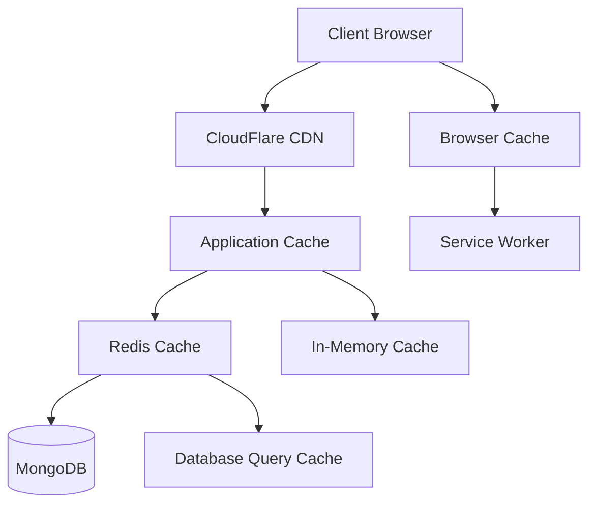

# Performance Optimization
<details>
  <summary>Project Design Table of Contents</summary>
  
- [Design Overview](./technical-design-toc.md) - Table of contents and summary
- [System Architecture Overview](./01-system-architecture.md) - High-level system design and component relationships
- [Project Structure](./02-project-structure.md) - Detailed folder organization and file layout
- [Database Design](./03-database-design.md) - MongoDB schema design and relationships
- [Backend API Design](./04-backend-api-design.md) - RESTful API v1 endpoints and specifications
- [Frontend Architecture](./05-frontend-architecture.md) - React component structure and state management
- [Authentication & Authorization](./06-auth-design.md) - JWT implementation and role-based access control
- [Subscription Management](./07-subscription-design.md) - Multi-tier subscription system and billing integration
- [Real-time Features](./08-realtime-design.md) - WebSocket implementation for live encounter tracking
- [Data Persistence Strategy](./09-data-persistence.md) - Cloud sync, offline storage, and backup systems
- [Security Implementation](./10-security-design.md) - Security measures, encryption, and compliance
- [Deployment Architecture](./11-deployment-design.md) - Infrastructure, CI/CD, and monitoring setup
- [Performance Optimization](./12-performance-design.md) - Caching, optimization, and scalability strategies
---
</details>

## Comprehensive Performance Strategy

The D&D Encounter Tracker implements multi-layered performance optimization strategies including intelligent caching, database optimization, frontend optimization, and horizontal scaling to ensure fast, responsive user experiences at scale.

## Caching Strategy

### Multi-Layer Caching Architecture


### Redis Caching Implementation
```typescript
class CacheService {
  private redis: Redis;
  private localCache: Map<string, CacheEntry> = new Map();
  private readonly TTL = {
    SHORT: 300,      // 5 minutes
    MEDIUM: 3600,    // 1 hour
    LONG: 86400,     // 24 hours
    EXTENDED: 604800 // 1 week
  };
  
  constructor() {
    this.redis = new Redis({
      host: process.env.REDIS_HOST,
      port: parseInt(process.env.REDIS_PORT || '6379'),
      password: process.env.REDIS_PASSWORD,
      retryDelayOnFailover: 100,
      maxRetriesPerRequest: 3,
      lazyConnect: true
    });
    
    this.setupCacheEviction();
  }
  
  async get<T>(key: string, useLocalCache: boolean = true): Promise<T | null> {
    // Try local cache first (if enabled)
    if (useLocalCache) {
      const localEntry = this.localCache.get(key);
      if (localEntry && localEntry.expiresAt > Date.now()) {
        return localEntry.value as T;
      }
    }
    
    try {
      // Try Redis cache
      const cached = await this.redis.get(key);
      if (cached) {
        const parsed = JSON.parse(cached) as T;
        
        // Update local cache
        if (useLocalCache) {
          this.localCache.set(key, {
            value: parsed,
            expiresAt: Date.now() + (this.TTL.SHORT * 1000)
          });
        }
        
        return parsed;
      }
    } catch (error) {
      console.warn('Redis cache miss:', error);
    }
    
    return null;
  }
  
  async set<T>(
    key: string, 
    value: T, 
    ttl: number = this.TTL.MEDIUM,
    useLocalCache: boolean = true
  ): Promise<void> {
    try {
      // Set in Redis
      await this.redis.setex(key, ttl, JSON.stringify(value));
      
      // Set in local cache with shorter TTL
      if (useLocalCache) {
        this.localCache.set(key, {
          value,
          expiresAt: Date.now() + Math.min(ttl, this.TTL.SHORT) * 1000
        });
      }
    } catch (error) {
      console.error('Cache set error:', error);
    }
  }
  
  async invalidate(pattern: string): Promise<void> {
    try {
      // Clear from Redis
      const keys = await this.redis.keys(pattern);
      if (keys.length > 0) {
        await this.redis.del(...keys);
      }
      
      // Clear from local cache
      for (const [key] of this.localCache) {
        if (this.matchesPattern(key, pattern)) {
          this.localCache.delete(key);
        }
      }
    } catch (error) {
      console.error('Cache invalidation error:', error);
    }
  }
  
  private setupCacheEviction(): void {
    // Clean up expired local cache entries every 5 minutes
    setInterval(() => {
      const now = Date.now();
      for (const [key, entry] of this.localCache) {
        if (entry.expiresAt <= now) {
          this.localCache.delete(key);
        }
      }
    }, 5 * 60 * 1000);
  }
  
  private matchesPattern(key: string, pattern: string): boolean {
    const regex = new RegExp(pattern.replace(/\*/g, '.*'));
    return regex.test(key);
  }
  
  // Cache decorators for methods
  static cached(ttl: number = 3600) {
    return function (target: any, propertyName: string, descriptor: PropertyDescriptor) {
      const method = descriptor.value;
      
      descriptor.value = async function (...args: any[]) {
        const cacheKey = `${target.constructor.name}:${propertyName}:${JSON.stringify(args)}`;
        
        const cached = await cacheService.get(cacheKey);
        if (cached !== null) {
          return cached;
        }
        
        const result = await method.apply(this, args);
        await cacheService.set(cacheKey, result, ttl);
        
        return result;
      };
    };
  }
}

interface CacheEntry {
  value: any;
  expiresAt: number;
}
```

### Application-Level Caching
```typescript
class DataCacheService {
  private cacheService: CacheService;
  
  constructor(cacheService: CacheService) {
    this.cacheService = cacheService;
  }
  
  // Cache user subscription features
  @CacheService.cached(1800) // 30 minutes
  async getUserFeatures(userId: string): Promise<FeatureSet> {
    const user = await User.findById(userId).populate('subscription');
    return user?.features || {};
  }
  
  // Cache subscription tiers
  @CacheService.cached(86400) // 24 hours
  async getSubscriptionTiers(): Promise<SubscriptionTier[]> {
    return SubscriptionTier.find({ isActive: true });
  }
  
  // Cache creature templates
  @CacheService.cached(3600) // 1 hour
  async getCreatureTemplates(): Promise<Creature[]> {
    return Creature.find({ isTemplate: true, userId: null });
  }
  
  // Cache party data with shorter TTL for active sessions
  async getCachedParty(partyId: string, userId: string): Promise<Party | null> {
    const cacheKey = `party:${partyId}:${userId}`;
    
    let party = await this.cacheService.get<Party>(cacheKey);
    if (!party) {
      party = await Party.findOne({ _id: partyId, userId });
      if (party) {
        await this.cacheService.set(cacheKey, party, 600); // 10 minutes
      }
    }
    
    return party;
  }
  
  // Invalidate cache when data changes
  async invalidateUserCache(userId: string): Promise<void> {
    await this.cacheService.invalidate(`*:${userId}:*`);
    await this.cacheService.invalidate(`user:${userId}:*`);
  }
  
  async invalidatePartyCache(partyId: string): Promise<void> {
    await this.cacheService.invalidate(`party:${partyId}:*`);
  }
}
```

## Database Optimization

## Database Optimization

### Query Optimization and Indexing
```typescript
class DatabaseOptimizationService {
  // Optimized queries with proper indexing
  static async getPartiesWithPagination(
    userId: string, 
    limit: number = 20, 
    cursor?: string
  ): Promise<{ parties: Party[]; hasNext: boolean; nextCursor?: string }> {
    const query: any = { userId: new mongoose.Types.ObjectId(userId) };
    
    if (cursor) {
      query._id = { $gt: new mongoose.Types.ObjectId(cursor) };
    }
    
    // Use compound index: { userId: 1, _id: 1 }
    const parties = await Party
      .find(query)
      .sort({ _id: 1 })
      .limit(limit + 1)
      .select('name description createdAt updatedAt characters')
      .lean()
      .exec();
    
    const hasNext = parties.length > limit;
    if (hasNext) {
      parties.pop();
    }
    
    return {
      parties,
      hasNext,
      nextCursor: hasNext ? parties[parties.length - 1]._id.toString() : undefined
    };
  }
  
  // Aggregation pipeline for analytics
  static async getUserAnalytics(userId: string): Promise<UserAnalytics> {
    const result = await User.aggregate([
      { $match: { _id: new mongoose.Types.ObjectId(userId) } },
      {
        $lookup: {
          from: 'parties',
          localField: '_id',
          foreignField: 'userId',
          as: 'parties'
        }
      },
      {
        $lookup: {
          from: 'encounters',
          localField: '_id',
          foreignField: 'userId',
          as: 'encounters'
        }
      },
      {
        $lookup: {
          from: 'creatures',
          localField: '_id',
          foreignField: 'userId',
          as: 'creatures'
        }
      },
      {
        $project: {
          username: 1,
          subscription: 1,
          totalParties: { $size: '$parties' },
          totalEncounters: { $size: '$encounters' },
          totalCreatures: { $size: '$creatures' },
          activeEncounters: {
            $size: {
              $filter: {
                input: '$encounters',
                cond: { $eq: ['$this.status', 'active'] }
              }
            }
          },
          avgPartySize: {
            $avg: {
              $map: {
                input: '$parties',
                as: 'party',
                in: { $size: '$party.characters' }
              }
            }
          }
        }
      }
    ]);
    
    return result[0] || null;
  }
  
  // Optimized encounter queries with participant data
  static async getEncounterWithParticipants(encounterId: string): Promise<Encounter | null> {
    // Use single query with embedded data instead of multiple lookups
    return Encounter
      .findById(encounterId)
      .populate({
        path: 'participants.referenceId',
        select: 'name ac maxHP dexterity classes race'
      })
      .lean()
      .exec();
  }
  
  // Batch operations for better performance
  static async updateMultipleParticipantHP(
    encounterId: string,
    updates: Array<{ participantId: string; newHP: number }>
  ): Promise<void> {
    const bulkOps = updates.map(update => ({
      updateOne: {
        filter: {
          _id: new mongoose.Types.ObjectId(encounterId),
          'participants._id': new mongoose.Types.ObjectId(update.participantId)
        },
        update: {
          $set: {
            'participants.$.currentHP': update.newHP,
            updatedAt: new Date()
          }
        }
      }
    }));
    
    await Encounter.bulkWrite(bulkOps);
  }
}
```

### Connection Pool Optimization
```typescript
class DatabaseConnectionManager {
  static configureOptimalConnection(): void {
    const connectionOptions: mongoose.ConnectOptions = {
      // Connection pool settings
      maxPoolSize: process.env.NODE_ENV === 'production' ? 100 : 10,
      minPoolSize: 5,
      maxIdleTimeMS: 30000,
      serverSelectionTimeoutMS: 5000,
      socketTimeoutMS: 45000,
      
      // Performance optimizations
      bufferMaxEntries: 0, // Disable mongoose buffering
      bufferCommands: false,
      
      // Compression
      compressors: ['zlib'],
      zlibCompressionLevel: 6,
      
      // Write concern for performance vs durability balance
      w: 'majority',
      wtimeoutMS: 10000,
      
      // Read preference for read-heavy workloads
      readPreference: 'secondaryPreferred',
      readConcern: { level: 'majority' }
    };
    
    mongoose.connect(process.env.MONGODB_URI!, connectionOptions);
    
    // Monitor connection events
    mongoose.connection.on('connected', () => {
      console.log('MongoDB connected successfully');
    });
    
    mongoose.connection.on('error', (err) => {
      console.error('MongoDB connection error:', err);
    });
    
    mongoose.connection.on('disconnected', () => {
      console.log('MongoDB disconnected');
    });
    
    // Graceful shutdown
    process.on('SIGINT', async () => {
      await mongoose.connection.close();
      process.exit(0);
    });
  }
  
  // Database query monitoring
  static setupQueryMonitoring(): void {
    mongoose.set('debug', (collectionName: string, method: string, query: any, doc: any) => {
      const executionTime = Date.now();
      console.log(`MongoDB Query: ${collectionName}.${method}`, {
        query: JSON.stringify(query),
        executionTime: `${executionTime}ms`
      });
      
      // Alert on slow queries (>1000ms)
      if (executionTime > 1000) {
        console.warn(`Slow query detected: ${collectionName}.${method} took ${executionTime}ms`);
      }
    });
  }
}
```

## Frontend Performance Optimization

### Code Splitting and Lazy Loading
```typescript
// Route-based code splitting
const LazyDashboard = lazy(() => import('../pages/Dashboard'));
const LazyEncounterTracker = lazy(() => import('../features/encounters/EncounterTracker'));
const LazyAdminPanel = lazy(() => import('../features/admin/AdminPanel'));

// Component-based code splitting
const LazyCharacterSheet = lazy(() => 
  import('../components/CharacterSheet').then(module => ({
    default: module.CharacterSheet
  }))
);

// Preload critical routes
const preloadRoutes = () => {
  // Preload dashboard for authenticated users
  if (isAuthenticated) {
    import('../pages/Dashboard');
  }
  
  // Preload encounter tracker for premium users
  if (isPremiumUser) {
    import('../features/encounters/EncounterTracker');
  }
};

// Smart component loading with intersection observer
const useLazyComponent = (threshold: number = 0.1) => {
  const [shouldLoad, setShouldLoad] = useState(false);
  const ref = useRef<HTMLDivElement>(null);
  
  useEffect(() => {
    const observer = new IntersectionObserver(
      ([entry]) => {
        if (entry.isIntersecting) {
          setShouldLoad(true);
          observer.disconnect();
        }
      },
      { threshold }
    );
    
    if (ref.current) {
      observer.observe(ref.current);
    }
    
    return () => observer.disconnect();
  }, [threshold]);
  
  return { ref, shouldLoad };
};
```

### React Performance Optimizations
```typescript
// Memoized components with proper dependencies
const EncounterParticipant = memo<EncounterParticipantProps>(({ 
  participant, 
  isCurrentTurn, 
  onHPChange, 
  onAddCondition 
}) => {
  const handleHPChange = useCallback((newHP: number) => {
    onHPChange(participant.id, newHP);
  }, [participant.id, onHPChange]);
  
  const handleAddCondition = useCallback((condition: Condition) => {
    onAddCondition(participant.id, condition);
  }, [participant.id, onAddCondition]);
  
  return (
    <div className={`participant ${isCurrentTurn ? 'current-turn' : ''}`}>
      <ParticipantHeader participant={participant} />
      <HPTracker 
        currentHP={participant.currentHP}
        maxHP={participant.maxHP}
        onChange={handleHPChange}
      />
      <ConditionManager 
        conditions={participant.conditions}
        onAddCondition={handleAddCondition}
      />
    </div>
  );
}, (prevProps, nextProps) => {
  // Custom comparison for deep object props
  return (
    prevProps.participant.id === nextProps.participant.id &&
    prevProps.participant.currentHP === nextProps.participant.currentHP &&
    prevProps.participant.conditions.length === nextProps.participant.conditions.length &&
    prevProps.isCurrentTurn === nextProps.isCurrentTurn
  );
});

// Virtual scrolling for large lists
const VirtualizedList = <T extends any>({ 
  items, 
  itemHeight, 
  renderItem,
  containerHeight = 400 
}: VirtualizedListProps<T>) => {
  const [scrollTop, setScrollTop] = useState(0);
  const containerRef = useRef<HTMLDivElement>(null);
  
  const visibleCount = Math.ceil(containerHeight / itemHeight);
  const totalHeight = items.length * itemHeight;
  const startIndex = Math.floor(scrollTop / itemHeight);
  const endIndex = Math.min(startIndex + visibleCount + 1, items.length);
  
  const visibleItems = items.slice(startIndex, endIndex);
  
  const handleScroll = useCallback((e: React.UIEvent<HTMLDivElement>) => {
    setScrollTop(e.currentTarget.scrollTop);
  }, []);
  
  return (
    <div
      ref={containerRef}
      style={{ height: containerHeight, overflow: 'auto' }}
      onScroll={handleScroll}
    >
      <div style={{ height: totalHeight, position: 'relative' }}>
        <div
          style={{
            transform: `translateY(${startIndex * itemHeight}px)`,
            position: 'absolute',
            top: 0,
            left: 0,
            right: 0
          }}
        >
          {visibleItems.map((item, index) => 
            renderItem(item, startIndex + index)
          )}
        </div>
      </div>
    </div>
  );
};

// Debounced search hook
const useDebouncedSearch = (searchTerm: string, delay: number = 300) => {
  const [debouncedTerm, setDebouncedTerm] = useState(searchTerm);
  
  useEffect(() => {
    const handler = setTimeout(() => {
      setDebouncedTerm(searchTerm);
    }, delay);
    
    return () => clearTimeout(handler);
  }, [searchTerm, delay]);
  
  return debouncedTerm;
};
```

### Asset Optimization
```typescript
// Image optimization service
class ImageOptimizationService {
  static generateResponsiveImageSet(baseUrl: string, sizes: number[]): string {
    return sizes
      .map(size => `${baseUrl}?w=${size}&q=75 ${size}w`)
      .join(', ');
  }
  
  static getOptimizedImageUrl(
    url: string, 
    options: { width?: number; height?: number; quality?: number; format?: string } = {}
  ): string {
    const params = new URLSearchParams();
    
    if (options.width) params.set('w', options.width.toString());
    if (options.height) params.set('h', options.height.toString());
    if (options.quality) params.set('q', options.quality.toString());
    if (options.format) params.set('f', options.format);
    
    return `${url}?${params.toString()}`;
  }
}

// Lazy image component with placeholder
const LazyImage: React.FC<LazyImageProps> = ({ 
  src, 
  alt, 
  placeholder,
  className,
  ...props 
}) => {
  const [isLoaded, setIsLoaded] = useState(false);
  const [isInView, setIsInView] = useState(false);
  const imgRef = useRef<HTMLImageElement>(null);
  
  useEffect(() => {
    const observer = new IntersectionObserver(
      ([entry]) => {
        if (entry.isIntersecting) {
          setIsInView(true);
          observer.disconnect();
        }
      },
      { threshold: 0.1 }
    );
    
    if (imgRef.current) {
      observer.observe(imgRef.current);
    }
    
    return () => observer.disconnect();
  }, []);
  
  return (
    <div className={`relative ${className}`} ref={imgRef}>
      {placeholder && !isLoaded && (
        <div className="absolute inset-0 bg-gray-200 animate-pulse rounded" />
      )}
      {isInView && (
         setIsLoaded(true)}
          className={`transition-opacity duration-300 ${
            isLoaded ? 'opacity-100' : 'opacity-0'
          }`}
          {...props}
        />
      )}
    </div>
  );
};
```

## API Performance Optimization

### Response Optimization
```typescript
class ResponseOptimizationService {
  // Response compression
  static setupCompression(app: express.Application): void {
    app.use(compression({
      filter: (req, res) => {
        if (req.headers['x-no-compression']) {
          return false;
        }
        return compression.filter(req, res);
      },
      level: 6,
      threshold: 1024, // Only compress responses > 1KB
      chunkSize: 16 * 1024, // 16KB chunks
    }));
  }
  
  // Response streaming for large datasets
  static streamResponse<T>(
    res: express.Response,
    dataStream: AsyncIterable<T>,
    transformer?: (item: T) => any
  ): void {
    res.writeHead(200, {
      'Content-Type': 'application/json',
      'Transfer-Encoding': 'chunked'
    });
    
    res.write('{"success":true,"data":[');
    
    let first = true;
    
    (async () => {
      try {
        for await (const item of dataStream) {
          if (!first) {
            res.write(',');
          }
          
          const processedItem = transformer ? transformer(item) : item;
          res.write(JSON.stringify(processedItem));
          first = false;
        }
        
        res.write(']}');
        res.end();
      } catch (error) {
        res.write(`],"error":${JSON.stringify(error.message)}}`);
        res.end();
      }
    })();
  }
  
  // Field selection for minimal payloads
  static selectFields<T>(
    query: mongoose.Query<T[], T>,
    fields?: string[]
  ): mongoose.Query<T[], T> {
    if (fields && fields.length > 0) {
      return query.select(fields.join(' '));
    }
    return query;
  }
  
  // Response transformation
  static transformResponse(data: any, transformations: ResponseTransformation[]): any {
    return transformations.reduce((acc, transformation) => {
      switch (transformation.type) {
        case 'omit':
          return this.omitFields(acc, transformation.fields);
        case 'pick':
          return this.pickFields(acc, transformation.fields);
        case 'rename':
          return this.renameFields(acc, transformation.mapping);
        default:
          return acc;
      }
    }, data);
  }
  
  private static omitFields(obj: any, fields: string[]): any {
    if (Array.isArray(obj)) {
      return obj.map(item => this.omitFields(item, fields));
    }
    
    const result = { ...obj };
    fields.forEach(field => delete result[field]);
    return result;
  }
  
  private static pickFields(obj: any, fields: string[]): any {
    if (Array.isArray(obj)) {
      return obj.map(item => this.pickFields(item, fields));
    }
    
    const result: any = {};
    fields.forEach(field => {
      if (obj[field] !== undefined) {
        result[field] = obj[field];
      }
    });
    return result;
  }
  
  private static renameFields(obj: any, mapping: Record<string, string>): any {
    if (Array.isArray(obj)) {
      return obj.map(item => this.renameFields(item, mapping));
    }
    
    const result = { ...obj };
    Object.entries(mapping).forEach(([oldKey, newKey]) => {
      if (result[oldKey] !== undefined) {
        result[newKey] = result[oldKey];
        delete result[oldKey];
      }
    });
    return result;
  }
}

interface ResponseTransformation {
  type: 'omit' | 'pick' | 'rename';
  fields?: string[];
  mapping?: Record<string, string>;
}
```

### Request Batching and Deduplication
```typescript
class RequestOptimizationService {
  private batchQueue = new Map<string, BatchRequest>();
  private requestCache = new Map<string, Promise<any>>();
  
  // Batch similar requests together
  async batchRequest<T>(
    key: string,
    request: () => Promise<T>,
    batchWindow: number = 50
  ): Promise<T> {
    return new Promise((resolve, reject) => {
      const existingBatch = this.batchQueue.get(key);
      
      if (existingBatch) {
        existingBatch.requests.push({ resolve, reject });
        return;
      }
      
      const batch: BatchRequest = {
        requests: [{ resolve, reject }],
        timeout: setTimeout(async () => {
          this.batchQueue.delete(key);
          
          try {
            const result = await request();
            batch.requests.forEach(req => req.resolve(result));
          } catch (error) {
            batch.requests.forEach(req => req.reject(error));
          }
        }, batchWindow)
      };
      
      this.batchQueue.set(key, batch);
    });
  }
  
  // Deduplicate identical requests
  async deduplicateRequest<T>(
    key: string,
    request: () => Promise<T>,
    ttl: number = 1000
  ): Promise<T> {
    const existingRequest = this.requestCache.get(key);
    
    if (existingRequest) {
      return existingRequest;
    }
    
    const promise = request().finally(() => {
      setTimeout(() => {
        this.requestCache.delete(key);
      }, ttl);
    });
    
    this.requestCache.set(key, promise);
    return promise;
  }
  
  // DataLoader implementation for N+1 query prevention
  createDataLoader<K, V>(
    batchLoadFn: (keys: readonly K[]) => Promise<readonly V[]>,
    options?: { cache?: boolean; maxBatchSize?: number }
  ): DataLoader<K, V> {
    return new DataLoader(batchLoadFn, {
      cache: options?.cache ?? true,
      maxBatchSize: options?.maxBatchSize ?? 100,
      cacheKeyFn: (key) => JSON.stringify(key)
    });
  }
}

interface BatchRequest {
  requests: Array<{
    resolve: (value: any) => void;
    reject: (error: any) => void;
  }>;
  timeout: NodeJS.Timeout;
}
```

## Scalability Strategies

### Horizontal Scaling Architecture
```typescript
class ScalingService {
  // Load balancing strategy
  static setupLoadBalancing(): void {
    // Health check endpoint for load balancer
    app.get('/health', (req, res) => {
      const health = {
        status: 'healthy',
        timestamp: new Date().toISOString(),
        uptime: process.uptime(),
        memory: process.memoryUsage(),
        version: process.env.npm_package_version
      };
      
      res.status(200).json(health);
    });
    
    // Graceful shutdown handling
    process.on('SIGTERM', () => {
      console.log('SIGTERM received, shutting down gracefully');
      
      // Stop accepting new connections
      server.close(() => {
        console.log('HTTP server closed');
        
        // Close database connections
        mongoose.connection.close(false, () => {
          console.log('MongoDB connection closed');
          process.exit(0);
        });
      });
    });
  }
  
  // Auto-scaling metrics
  static collectScalingMetrics(): ScalingMetrics {
    return {
      cpuUsage: process.cpuUsage(),
      memoryUsage: process.memoryUsage(),
      activeConnections: server.connections || 0,
      requestRate: metricsService.getRequestRate(),
      responseTime: metricsService.getAverageResponseTime(),
      errorRate: metricsService.getErrorRate()
    };
  }
  
  // Database read scaling with read replicas
  static createReadOnlyConnection(): mongoose.Connection {
    return mongoose.createConnection(process.env.MONGODB_READ_URI!, {
      readPreference: 'secondary',
      readConcern: { level: 'majority' }
    });
  }
  
  // Implement database sharding strategy
  static getShardKey(userId: string): string {
    // Simple hash-based sharding
    const hash = crypto.createHash('md5').update(userId).digest('hex');
    const shardNumber = parseInt(hash.substr(0, 8), 16) % 4; // 4 shards
    return `shard_${shardNumber}`;
  }
}

interface ScalingMetrics {
  cpuUsage: NodeJS.CpuUsage;
  memoryUsage: NodeJS.MemoryUsage;
  activeConnections: number;
  requestRate: number;
  responseTime: number;
  errorRate: number;
}
```

### CDN and Edge Optimization
```typescript
class CDNOptimizationService {
  // CloudFlare integration
  static setupCloudFlareOptimization(): void {
    // Set appropriate cache headers
    app.use((req, res, next) => {
      if (req.path.match(/\.(js|css|png|jpg|jpeg|gif|ico|svg)$/)) {
        // Static assets - cache for 1 year
        res.set({
          'Cache-Control': 'public, max-age=31536000, immutable',
          'Expires': new Date(Date.now() + 31536000000).toUTCString()
        });
      } else if (req.path.startsWith('/api/')) {
        // API responses - cache based on content
        if (req.method === 'GET' && !req.headers.authorization) {
          res.set({
            'Cache-Control': 'public, max-age=300', // 5 minutes for public API
            'Vary': 'Accept-Encoding'
          });
        } else {
          res.set({
            'Cache-Control': 'private, no-cache, no-store, must-revalidate'
          });
        }
      }
      
      next();
    });
  }
  
  // Edge function for geolocation-based content
  static async getLocationBasedContent(request: Request): Promise<Response> {
    const country = request.headers.get('CF-IPCountry');
    const timezone = request.headers.get('CF-Timezone');
    
    // Customize content based on location
    const content = await this.getLocalizedContent(country, timezone);
    
    return new Response(JSON.stringify(content), {
      headers: {
        'Content-Type': 'application/json',
        'Cache-Control': 'public, max-age=3600', // Cache for 1 hour
        'Vary': 'CF-IPCountry'
      }
    });
  }
  
  private static async getLocalizedContent(
    country?: string, 
    timezone?: string
  ): Promise<any> {
    // Implementation for localized content
    return {
      country,
      timezone,
      features: await this.getCountrySpecificFeatures(country)
    };
  }
}
```

This comprehensive performance optimization strategy ensures the D&D Encounter Tracker can handle thousands of concurrent users while maintaining fast response times and excellent user experience through intelligent caching, database optimization, frontend performance enhancements, and scalable architecture design.